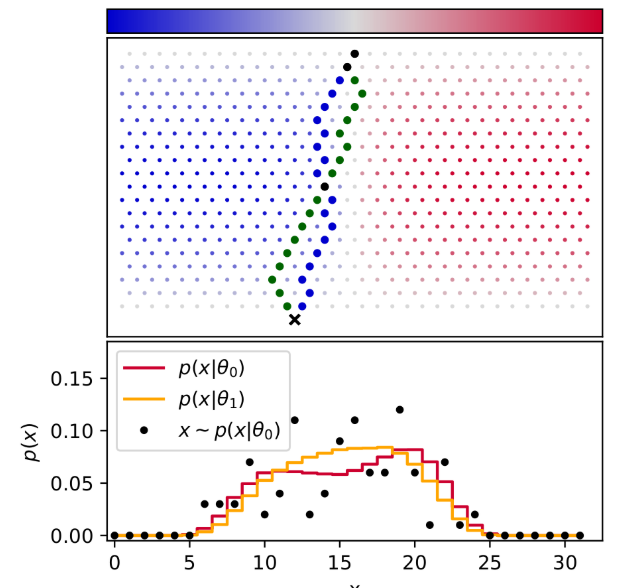

# ABC 1. MLE

​	공부를 하다고 보면 아주 흔하게 만나는 likelihood(우도) 는 통계모델 또는 기계학습의 분야에서 중요하게 다루어지는 개념중 하나이다. 

**Likelihood**

>  measures the [goodness of fit](https://en.wikipedia.org/wiki/Goodness_of_fit) of a [statistical model](https://en.wikipedia.org/wiki/Statistical_model) to a [sample of data](https://en.wikipedia.org/wiki/Sample_(statistics)) for given values of the unknown [parameters](https://en.wikipedia.org/wiki/Statistical_parameter)

 : 모수가 주어졌을 때 , 데이터에 대한 통계적인 모델이 얼마나 적합한지 설명하는 함수.

#### exmaple

지구에 있는 모든 참나무의 평균밀도 분포를  알고 싶다!. 일반적인 흐름은 다음과 같을 것이다. 

	1. 우리가 알고싶은건 참나무의 밀도 분포
 	2. 그래서 표본을 뽑아서 참나무의 밀도를  **''추정''** 하고자 한다.
 	3. 세계 곳곳에서 참나무들을 샘플링 한다.
 	4. `샘플링한 참나무들의 데이터를 토대로 참나무의 평균밀도를 추정한다.`

우리가 아는 일반적인 Maximum Likelihood Estimation(MLE)는 다음과 같은 방식으로 **추정**된다.

우리는 샘플링한 데이터를 가지고 있다. 이 데이터는 참나무 밀도를 결정하는 어떤 모수에 의해서 얻은 데이터이다. 표현하면 다음과 같다

* P(X|&theta;) : 우리가 얻은 샘플링 데이터

&theta; 는 확률변수가 아니라, 우리가 알지 못하는 어떤 값이다. 위의 notation을 다음과 같이 바꿀수 있다.

*  P(X; &theta;) = P(x1,x2,x3,x4 .. ; &theta;)  = &prod;p(x_i|&theta;)
* L(X|&theta;) 혹은 L(&theta;|X)

MLE의 목적은 likelihood 함수를 최대화 시켜주는  모수  &theta; 를 찾는 것이다.
$$
\theta_{MLE} = argmax_{\theta} logP(X|\theta)
$$

관측치들의 분포를 살펴보니 다음과 같았다. 우리는 다음과 같은 관측치들을 가지게하는 가장 높은 확률의 모수로 추정한다.

우리는 정확한 밀도는 모른다. 다만 추정할 뿐이다.
$$
\theta \approx \theta_{MLE}
$$

못이 박힌 판에 구슬을 위에서 아래로 흘려보내보자.

구슬이 x 지점에 도달할 확률을 알고싶다. 그러면 우리는 모든 가능한 경로에서 x지점에 구슬이 도달할 누적확률을 구하면 된다. 
$$
p(x) = \int_{z} p(x,z)dP_{z}
$$

* p(x) : 경로 x에 도달할 확률 
* z : 가능한 모든 경로
* p(z) : 해당경로를 선택할 확률

10가지 경로가 존재한다고 하자. 그중 x에 도달하는 경로는 단 두가지이다.  p(x) = 0.2 이다? 

경로를 선택할 확률이 포함되어야 한다.

경로는 수 많은 못에 의해서 경로가 결정된다. x에 도달할 확률은 못에의해 결정된다. 각 층의 못을 기준으로 못 왼쪽으로 구슬이 이동할 확률을 &theta; , 못 오른쪽으로 구슬이 이동할 확률은 1-&theta; 이다.  결국 마지막에 지점 x 에 도달하는 구슬들은 경로에 상관없이 모두 동일한 오른쪽이동 횟수, 왼쪽이동 횟수를 가져야한다. 

$$
p(x|\theta) = \int_{z}p(x,z|\theta)dP{z} \\
= \left(\begin{array}{cc} {n \\ x} \end{array}\right)\theta^x(1-\theta)^{n-x}
$$

다음과 같은 binomial-distribution 형태로 어떤 지점에 도달할 확률이 결정될 것이다.

각각의 지점 $x_i$의 구슬은 위의 확률이 실현화 된 것이다. 못의 왼/오 선택의 확률이 정해지면 관측치는 stochastic하게 정해지게 된다. `문제는 우리가 못의 왼/오 확률을 모른다는 것과 그 확률을 알고싶다는 점이다.theta에 의해서 관측치들의 실현이 결정된다. theta는 모수이다.`

예를들어 구슬 100개를 흘려보냈을때 *"x 지점"* 에 도달한 구슬은 10개이다. MLE의 관점은 **구슬10개가 x지점에 도달하게하는 가장 높은 확률의 &theta;** 를 추론의 결과로 간주하는것이다.

### "MLE는 관측치를 가장 잘 만들어내는 모수를 선택하는 것이다 "

머신러닝 딥러닝에서 사용하는 loss 함수도 MLE와 궤를 같이 한다. 데이터의 likelihood를 최대화 하는 weight를 선택하는 것이다.  못의 확률을 바꾸는 것처럼, 각 weight를 조정해가며 likelihood를 최대화 시킨다.

같은 optimization 문제이지만 MLE는 maximization의 문제이고 딥러닝 학습시는 loss 함수를 minimization한다. 

**binary cross entropy**
$$
Loss = -\sum({y_i}logp_{\theta}(y|x_i) + (1-y_i)log(1-p_{\theta})(y|x_i))
$$

**Likelihood**
$$
p(y|\theta) = \prod_i \theta_i^{y_i}(1-\theta_i)^{1-y_i}
$$
데이터가 주어졌을 떄 likelihood
$$
p(y|x,\theta) = \prod_i p_\theta(y|x_i)_i^{y_i}(1-p_\theta(y|x_i))^{1-y_i}
$$
log-likelihood
$$
\sum_i (y_ilogp_\theta(y|x_i) + (1-y_i)log(1-p_\theta)(y|x_i))
$$

만약 모수(&theta;)의 값이 달라지면 어떨까?

*실현된 관측치의 분포가 달라졌다.*

여전히 구슬이 x 지점에서 끝날 확률은 시작점에서 x 지점까지 가능한 모든경로들의 누적확률로 표현될 수 있다.

층이 쌓이수록 , 다시말해서 n이 증가할 수록 p(x|&theta;)는 풀기 어려운 문제가 된다. 가능한 조합들의 경로가 기하 급수적으로 증가하기 떄문에.

반면 observation을 만들어내는 것은 쉬운 문제다. 그냥 공을 굴리면 된다.

