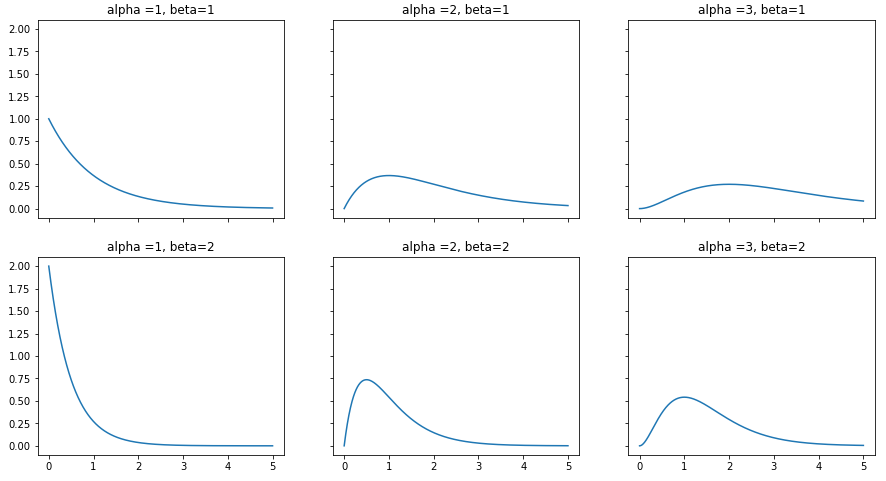

# Gamma distribution

감마분포는 여러다른 분포들과의 연관성이 깊다. 베타, 포아송, 지수분포, t분포 등등.  이런 점에서 감마분포는 여타 다른분포를 일반화할 수 있는 성질을 가지고 있는것 같기도 하다. 수학적으로 깊은 내용은 아니겠지만 일반적인 감마분포의 특징과 베이지안 모델에서 감마분포의 쓰임새를 조금 조사해보았다.

## Gamma

감마 분포는 연속확률분포로 범위가 $[0,\infin]$ 이며 아래와 같은 형태로 나타낼 수 있다.

$$
f(x) = \frac {\beta^{\alpha} x^{\alpha -1}e^{-\beta x}} {\Gamma(\alpha)}
$$

감마 분포는 두가지 모수 $\alpha, \beta$ 를 가진다.  $\alpha$ 는 'shape parameter'라고도 하며 전반적인 분포의 형태를 결정한다. $\alpha<1$ 인 경우에는 극단적인 exponential decay 형태를 가지며 좌표축에 점근하는 경향을 보인다. $\alpha=1$ 인 경우에는 감마분포의 형태는 모수가 $\beta$ 인 지수함수와 같아진다( $Gamma(\alpha=1,\beta) = exp(\beta)$ ).  기본적으로 감마분포는 오른쪽 꼬리가 긴 형태이지만 $\alpha>1$ 이면서 점점 커져갈 수록 skewness가 줄어든다.

$\beta$ 는 'scale parameter' 로 이름그대로 전반인 분포의 스케일을 결정한다. $\alpha >1$ 인 경우의 감마분포는 증가세를 보이다가 하락하는 형태를 보여주는데 $\beta$가 커지면 커질수록 더 빠르고 급격한 증가세를 보여주며 전반적인 분포의 형태가 뾰족해지는 경향이 있다. $\beta$를 표기할 때 역수로 표기하는 경우도 많아서 헷갈리기 쉽다. 일반적으로 scale 은 $1/\beta$ 로 사용하기 때문에 위의 식에서 $\beta^{\alpha}$ 부분이 분모에 가기도 한다.(**본인도 아직 헷갈리는중..**)

또 모수를 이용하면 평균 및 분산을 쉽게 구할 수 있다.

* mean = $\alpha/\beta$
* variance = $\alpha/\beta^2$

## why Gamma

감마분포는 다양한 분포들과의 연관성이 깊기 떄문에 그 확장성이 크다. 다양한 사회현상을 모델링하는데 유용하다고 하는데 그 이면에는 많은 분포들을 아우를수 있는 특징이 아닐까 생각한다(**개인적인 생각**). 

감마분포는 lower bound가 0이기 때문에 양수인 데이터만 다루는 모델에 범용적으로 적용할 수 있고 alpha값이 커지면 점점 bell-shaped의 형태가 되기에 양수이면서 bell-shaped의 형태라면 감마분포를 이용한 모델링이 좋은 시작이 될것이라고 생각한다.

특히 사건간의 interval 시간의 모델링에 많이 사용되곤 하는데 포아송 분포와도 연관이 깊어보인다.

## Gamma conjugacy

우리가 가진 데이터의 형태가 포아송분포의 형태라면, 즉 이산형 자료이면서 동시에 주어진 단위시간동안 발생한 사건의 횟수 라면, 그때의 모수 $\lambda$ 에 사전분포로 conjugate 성질을 충족하는 감마분포는 적합한 선택이 된다.

$$
\begin{matrix}
Posterior &\propto& likelihood \times prior \\
&=& L(\lambda|x) \times p(\lambda) \\
&=& \frac {e^{-n \lambda} \lambda^{\sum x_i}} {\Pi (x_i!)} \\
&=& \lambda^{\sum x_i + \alpha -1} e^{-(n+\beta)\lambda}
\end{matrix}
$$

위와 같이 conjugate 성질를 이용하면 손쉽게 같은 감마분포 형태의 posterior을 구할 수 있다.=> $posterior \sim Gamma(\sum x_i +\alpha, n+\beta)$  

MCMC나 VI 처럼 근사의 방법들도 많이 나오고 해서 '굳이 conjugate를 사용할 필요는 없나?' 라고 생각한적이 있었다. 계산이 어려워도 근사하면 거의 잘 맞아 들어가니깐.. 하지만 conjugate를 쓰는 이유는 그런 이유에서만은 아닌것 같다. 비단 현재의 포아송-감마의 예가 아니더라도 conjugate을 이용하여 도출한 posterior을 살펴보면 기존의 prior에서 어떻게 분포가 업데이트 되는지 직관적으로 알 수 있는 경우가 많다.  이런 직관성은 모델링을 하는데 중요하다. 의미적인 맥락이 존재하면 분석자의 입장에서도 전반적인 모델의 흐름을 더 잘 이해할 수 있고, 더 잘 이해시킬수 있다. 그런 의미에서 다양한 분포들의 성질들, 그리고 관계들을 아는것이 베이지안 모델링을 잘 할 수 있는 방법이 아닐까 생각해본다.

## reference 

https://www.rocscience.com/help/swedge/swedge/Gamma_Distribution.htm