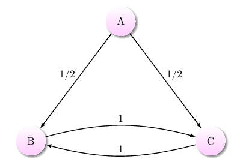
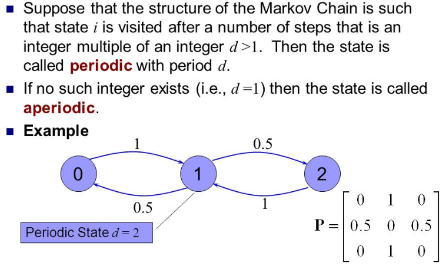
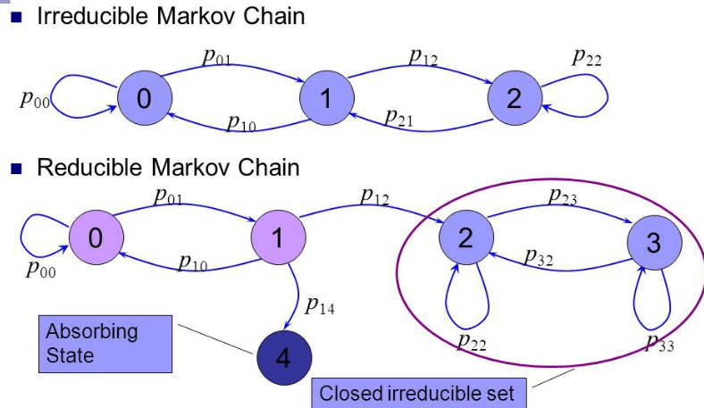
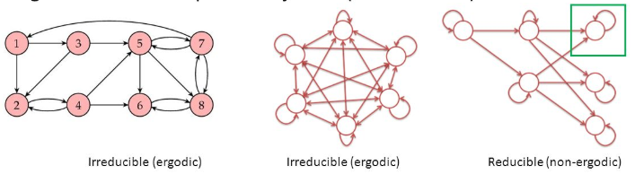
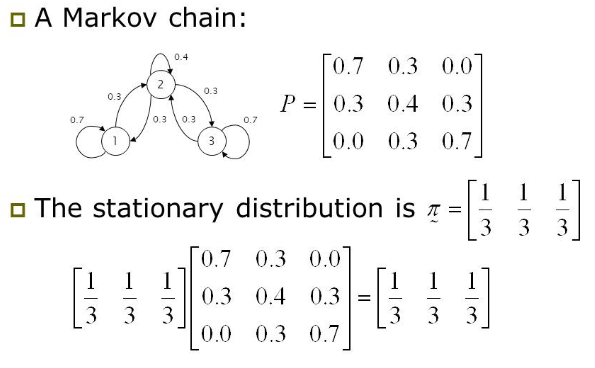
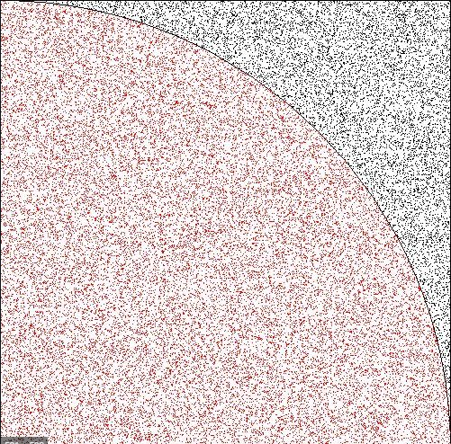

# MCMC1_basic

​	

**Markov Chain Monte Carlo** 비교적 최근까지의 베이지안을 이용한 추론방법의 꽃이라고 할만큼 중요한 역할을 했고 여전히 꽃이다(?). 그렇기에 빼놓을 수 없는 중요한 내용이고 이를 둘러싸고 있는 이론적인 바탕을 안다면 더 효과적인 베이지안 추론을 할 수 있을것이다. 이번포스팅은 MCMC의 기본인 Markov-chain 과 Monte-carlo 에 대해서 간단히 정리해 보았다.

## Markov chain basic

Markov chain은 시간에 따른 확률변수들의 시퀀스 이고, 다음의 'markov property'를 만족하면 markov chain이라 할 수 있다. 어떤 finite state space에서 확률변수 $X_{t}$ 는 다음 조건을 만족시키는 transition matrix P에 의해 정의 되어지는데
$$
P(X_{t+1}=j|X_{t}=i,X_{t-1}...,X_0) = P(X_{t+1}=j|X_t=i) = p_{ij}
$$

$p_{ij}$는 이동 확률이고 다음을 만족시킨다.
$$
p_{ij} \ge 0, \qquad \sum_jp_{ij}=1 \space \forall \space i
$$

이때의 확률변수 $X_t$ 는 오로지 직전 시간의 확률변수에 의해서만 결정이 된다(Markov property). (1) 에서의 $P(X_{t+1}=j|X_{t}=i,X_{t-1}...,X_0) = P(X_{t+1}=j|X_t=i)$ 가 의미하는 바는, 확률변수 $X_{t+1}$의 확률이 과거의 확률변수들 모두에 영향을 받는것이 아니고 오직 직전 확률변수 $X_{t}$ 에 의해서만 영향을 받는다는 의미이다. 

**Recurrence**

만약 특정 state i 를 t 시점에 지났을떄 다시 돌아올수 있다면 recurrence, 한번지나고 다시 못돌아온다면 transient라고 한다. 아래그림을 보자.

state A의 입장에서 B,C로 전이가 일어난 경우 다시는 state A로 돌아오지 못한다. 따라서 state A는 transient하다고 볼수 있고, B/C의 경우는 계속해서 재방문이 이루어 지기 떄문에 recurrence하다고 할 수 있다.

**positive recurrence**

앞서 설명한 recurrence의 개념은 다시 돌아올 확률이 존재해야한다는 내용이었다. 하지만 확률은 존재하지만 process을 시행함에 따라 그 확률이 점차 줄어든다면(확률에 곱이 계속되니) 이론상으로는 재방문이 가능하나 실제로는 좀처럼 일어나지 않을것이다. state i로 돌아올확률이 아주 작다면 계속되는 Chain에서 state i 로 돌아올떄까지 걸리는 **시간**이 계속해서 증가해 발산해버릴 것이다. state i 로 다시 돌아올 때까지 걸리는 평균 시간이 finite하다면 우리는 positive recurrence라고 할 수 있다.

**Periodicity**

process가 진행됨에 따라 state i 가 동일한 k 간격으로 돌아온다면 state i 는 k period를 가진다고 말할 수 있다.그림에서 state 1 의경우는 매 2 time 마다 자기자신으로 되돌아 오기 때문에 periodic 이라고 할 수 있는 반면, state 0/2 의경우는 일정한 시간 term이 아니라 stochastic하게 자기자신으로 돌아오기 때문에 aperiodic이라고 한다.

**irreducible**

'irreducible' 특징은, 어떤 state space($\Omega$)의 특정 state i 에서 특정 j로 이동이 가능하면 irreducible이라고 한다. 어떤 state를 선택하던간에 state space 내의 다른 state로 이동이 가능해야한다는 말이고 모든 state가 서로 연결이 되어 있어야한다는 말이다. 사실 위에서 설명한 'recurrence'특징과 동일하지만 'recurrence'가 개별 state에 초점을 맞춘것이라면 'irreducible'은 전체 chain의 관점에서 설명이라 할 수 있다.

'reducible'은 chain이 순환이 되지 않음을 의미한다. 그림에서 보듯이 state 4에 도달하게되면 다른 어떤 state로 이동이 불가능해지게 된다. state 4는 들어오는 확률은 있지만 나가는 확률이 없어 순환이 이루어지지 못한다. 

**Ergodicity**

단순하게 말하면, 앞서 설명한 성질들 중 irreducible 하고 aperiodic 하면 ergodic이다.

전체 chain의 프로세스에서 irreducible 하다는 말은 모든 state들이 서로 이동이 자유롭게 넘나들 수 있음을 의미한다. 또한 모든 state에서 자기자신으로 돌아오는 term이 불규칙하면 aperiodic이다. 가장 오른쪽 그림에서 초록색 state는 reducible함과 동시에 매 term마다 자기자신으로 돌아오는 규칙적인 period를 가지고 있어 ergodic이라 할 수 없다.

**stationary distribution**

확률 벡터 $\pi$ ($\pi_i \ge0$, $\sum_i\pi_i=1$) 가 다음조건을 만족시키면 stationary distribution이라 한다.
$$
\pi = \pi P
$$

stationary distribution인 $\pi$에 P matrix을 몇번이고 곱해주어도 $\pi$이다. 

irreducible한 chain이 positive recurrence 성질을 가진다면 stationary distribution을 가진다(iff 성질). 그리고 그때의 stationary distribution은 unique하다.

시작점이 어디든 상관없이 확률과정이 irreducible 하고, aperiodic한 markov chain이라면 stationary distribution으로 수렴하게된다.그리그 그때의 수렴하는 속도는 transition probability에 의해 정해지게 된다.

**detailed balance**

보통 국가간의 무역을 예로들어 설명을 많이한다. 국가간의 무역상황이 있다.

* $s_i$ : i 나라가 가지고 있는 부의 총합
* $q_{ij}$ : i 나라에서 j나라로 수출되는 부의 비율.
* $s_iq_{ij}$ : i나라에서 j나라로 수출되는 전체 부의 양.

만약 $s_iq_{ij}$ = $s_jq_{ji}$ 라면, 모든 나라간의 수출과 수입의 양이 동일하다. 이런형태의 markov chain이라면  chain이 반대로 되어도 수출 수입의 양에는 변화가없다(reversible). 만약 위와 같은 성질을 detailed balance라고 하고 이를 만족하는 chain이라면 s 는 stationary하다.
$$
\pi_jP(x_{i+1}=k|x_i=j) = \pi_kP(x_{i+1}=j|x_i=k)
$$

state 두 지점 간에 들어오는 양과 나가는 양은 밸런스를 유지한다. detailed balance를 다르게 표현하면 다음과 같다
$$
\frac {\pi_j} {\pi_k} = \frac {P(x_{i+1}=j|x_i=k)} {P(x_{i+1}=k|x_i=j)}
$$

## Monte Carlo simulation

'Monte Carlo' simulation은 큰수의 법칙을 바탕으로 한 근사의 방법중 하나로, **랜덤난수**를 충분히 많이 생성하여 얻은 경험적인 샘플링값을 실제 수학적인 값으로 근사시켜 나가는 방법을 의미한다. 생성한 난수의 수가 많으면 많을수록 더욱 정확한 추론이 가능해진다.
$$
\frac {1} {N} \sum^N_{i=1}f(x^{(i)}) \rightarrow \int_{\Omega}xf(x)p(x)dx
$$

예로, 아래 그림은 주어진 범위내 부채꼴의 면적을 Monte Carlo 를 이용한 접근이다.

정해진 범위내에서 무작위 난수를 생성하여 점을 찍어나간다고 했을 때, 전체 생성된 점 대비 부채꼴 안에 찍힌점의 비율은 부채꼴의 수학적인 넓이에 아주 정확한 수치로 근사된다.

시뮬레이션을 이용한 추론을 보면 우리가 sample 평균으로 모평균을 추정하는 것과 유사한점이 있다. 다만 중요한점은 **난수생성**의 과정의 포함여부이다. 'Monte Carlo' simulation 은 난수생성을 이용한 근사라는 점을 잊지 말자.

## reference 

https://www.seas.harvard.edu/courses/cs281/papers/roberts-rosenthal-2003.pdf

https://webee.technion.ac.il/shimkin/MC15/MC15lect6-MCMC.pdf

https://medium.com/@kim_hjun/markov-chain-stationary-distribution-5198941234f6