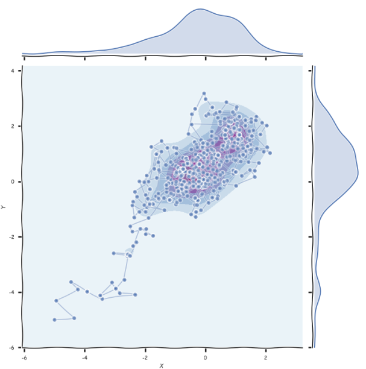
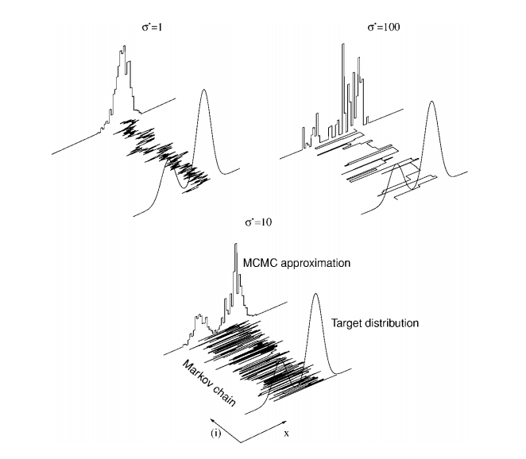

# MCMC2_Metropolis-Hastings

​	우리는 어떤 target distribution에서 sampling을 하려고한다. 이 target distribution은 우리가 구하고자하는 posterior distribution(사후분포)이라고 생각하면 된다. 문제는 모수가 증가함에 따라, 또는 일반적이지 않은 likelihood로 인해서 직접적인 계산이 힘들어 베이즈룰을 풀기가 불가능해질 때 발생한다. 

## 문제인식

​	

**sampling을 하는 이유**

비교적 최근까지도 computation 능력의 한계로 구현하지 못하는 방법들이 많았다 비단 통계학 뿐만 아니라. 하지만  computation 능력의 향상으로 어려웠던 문제들을 컴퓨터로 풀수 있게 되었고 컴퓨터공학이나 딥러닝과같은 학문들은 비약적으로 성장하기 시작해 현재 신 산업의 리더로 자리 매김해서 산업을 이끌고 있다.

베이지안 통계학의 핵심은 베이즈 룰이다. 베이즈룰을 계산하여 사후분포를 도출해내는 것이 사실 전부라고해도 될만큼 중요하다. 베이즈룰을 통해서 사후분포를 계산하려는 노력들은 과거서부터 있어왔다. **conjugate** 성질은 그러한 노력의 결과로 발견한 것이다. likelihood 함수와 사전분포가 특정 조합의 형태를 만족하면 사후분포가 사전분포와 같은 분포가 되고, 이로인해 사후분포를 단순히 likelihood와 사전분포의 형태만으로 알 수 있게되어 계산과정의 여러이점을 가져다 주었다. 하지만 실제 사회에서 우리가 만나는 데이터는 우리가 이론적으로 알고있는 직관적이고 간단한 형태의 분포를 가지지 않는경우가 많고, 모수의 개수가 늘어남에 따라 ,  또는 다변량인 분포로 인해 모수set이 늘어남에따라 적분의 계산을 하는것이 사실상 불가능해져 직접 사후분포를 수학적으로 도출하지 못하는 경우가 많다. 이 불가능한 계산을 만드는 녀석이 바로 흔히 'evidence'로 불리는 요놈이다.

$$
P(\theta|data) = \frac {P(data|\theta)P(\theta)} {P(data) \leftarrow 요놈}
$$

관측치의 확률인 $P(data)$는 marginal 하게 다음과같이 적분형태로 구할 수 있는데
$$
P(data) = \int_\theta P(data,\theta)d\theta
$$
문제는 모수의 차원이 깊어지면 $P(data)$ 의 적분이 사실상 불가능해지고 그래서 사후분포를 계산하지 못하게 되어 버리는 것이다. 

## MCMC

​	 **sampling** 방법은 computation능력의 향상으로 등장한 새로운 문제해결의 방법인데 수학적인 계산을 직접하는것이 아니라 **근사**의 방법을 사용하자는것이 기본아이디어이다. 

$$
\begin{matrix}P(\theta|data) &=& \frac {P(data|\theta)P(\theta)} {P(data)}\\&\propto& P(data|\theta)P(\theta) \end{matrix}
$$
모수 $\theta$의 관점에서, p(data) 는 모수에 의존하지 않기 때문에 상수와도 같다. 따라서 위와같이 사후분포를 likelihood x 사전분포의 비율로 나타낼수 있고 위와같은 표현으로 나타낼수 있게 된다. 

우리가 구하고자하는 사후분포를 직접 계산할 수 없으니, 우리가 아는 정보 $P(data|\theta)P(\theta)$ 를 이용해서 사후분포를 근사하는 것이 MCMC의 전략이다.  MCMC를 할 수 있기위해서는 두가지 조건이 필요하다.

* unique한 stationary distribution을 가지는 Markov Chain을 만들것.
* 이 stationary distribution은 우리가 구하고자하는 사후분포와 같아야할 것.

우선 첫번째로 unique stationary distribution을 가지는 Markov Chain을 만들기 위한 몇가지 조건을 살펴보자.

* ergodicity(aperiodic + irreducible)
* detailed balance

**aperiodic** 은 동일한 state에 확정적인 term으로 돌아오지 않고 random하게 돌아오는 성질을 의미한다. 매 2 term 마다 현재의 지점에 돌아오는 periodic을 가정하면 그 말인 즉슨 state간의 이동이 확률적인 것이 아니라 이미 정해져 있음을 생각할 수 있다. markov chain을 이산형인 'state' 단위를 넘어서 continous하게 확장하여 생각해보면 좌표평면상의 무수히 많은 점들간의 이동이 random하지 않고 정해진 규칙에 따라서 이동하는 것이고, 이는 우리가 찾으려는 어떤 target distribution에 도달할 수 없게 한다. **irreducible** 은 chain이 모든 'state'를 돌아다닐수 있어야 한다는 의미이다. 마찬가지로 좌표평면의 영역에서라면 우리가 만든 chain이 모든 영역을 이동할 가능성이 확률적으로 존재해야함을 말한다. 만약 irreducible하지 못하면 영역들간의 이동할 수 없는 부분들이 발생하고, target distribution이 혹시라도 그런 영역에서 존재한다면 샘플링이 불가능해게 된다.

**detailed balance(reversible)** 는 꽤 강한 가정인데 이 가정을 충족시키면 우리가 만든 markov chain이 target distribution에 수렴한다는걸 증명할 수 있다. 즉 모든 reversible markov chain은 stationary distribution을 가진다.  이 reversible 식은 metropolist hasting의 acceptance probability에서 구현되어 있다. 
$$
T(x_{k+1}|x_k)P(x_k) = T(x_k|x_{k+1})P(x_{k+1})
$$

## metropolis-hastings

​	먼저 x가 주어졌을때, y값에 대한 밀도함수/커널 Q를 만들어본다고 하자. 이 Q는 현재의 위치 x에서 다음의 위치 y로 랜덤하게 이동하는 방법을 정하기 때문에 transitional kernel라고 한다. markov-chain에서의 transitional matrix의 역할이다. 간단한 예로 다음 이동하려는 위치 y가 현재의 x에서 표준정규분포에서의 샘플링된 값만큼 더해진 위치라고 하면  $y = x+N(0,1)$ 로 표현할 수 있고  $y \sim N(x,1)$  , 즉 평균이 x이고 분산이 1인 함수에서 샘플링된 값으로도 표현할 수 있다. 따라서 이 경우의 Q는  다음과같이 정의될 수 있다.
$$
Q(y|x) = 1/\sqrt{2\pi} *exp[-0.5(y-x)^2]
$$
새로 이동할 위치를 얻기위해 현재 위치 x에서 random number를 더해주는 위와같은 형식의 커널을 'random walk'커널이라 부른다. 이런 역할때문에 'proposal distribution' 이라고도 한다. 다음 위치에 대한 제안을 하는 것이기 때문이다. 위의 예시처럼 symmetric한 분포를 제안함수(proposal distribution) 로 사용하게 되면 detailed balance가 만족된다. 

MH는 transition kernel Q를 이용해서 target dist $\pi$ 로부터 샘플링을 할 수 있게된다.그 순서는 다음을 따른다.

* 랜덤하게 초기의 state를 정한다.

* for t=1,2,..

  * 제안함수 Q로부터 y를 샘플링한다. $Q(y|x)$ 는 현재 제안된 상태이다 선택된게 아니다.
  * 그리고 이 제안을 받아들일지를 결정하는 (0,1) 사이의 acceptance probability A를 계산한다.

  $$
  A = min(1,\frac {\pi(y)Q(x_t|y)} {\pi(x_t)Q(y|x_t)})
  $$

  

  * A에 해당하는 확률로, 제안된 $Q(y|x)$ 를 $X_{t+1}$ 선택하고, 그렇지 않으면 $X_t$를 $X_{t+1}$로 선택한다. 

metropolist hastings의 전부이다. 간단한 형태이다. 이번에는 조금더 이야기의 형태로 살펴보자. 아래의 2차원 좌표공간에서 target distribtuion으로 수렴하려고 한다. 모수가 2개인 경우이다.

사전분포를 잘 선택하는 것은 샘플링에서 중요하다. 그러기 위해서는 근거가되는, 말이 되는 사전분포를 선택해야 한다.예를들어 확률 p에 대한 추론을 한다면 그 사전분포의 범위는 (0,1) 내에서만 존재해야한다. 모수에 대한 정보는 없지만 확률임을 알기 때문에 그에 합당해야한다. 또 위 그림처럼 사전분포의 설정이 target과 비슷한 공간이라면 잘 수렴할 수 있다. 

위의 그림을 이렇게 생각해보자. 우리는 두 모수에 대해서 uniform(-6,4)인 사전분포를 가정했다. 사전분포내에서 랜덤하게 한점이 주어졌고 이 점에서부터 시작하여 target으로 찾아가려고 한다. 위의 예시처럼 표준정규분포의 제안함수 Q라하면 
$$
Q(y|x) = 1/\sqrt{2\pi} *exp[-0.5(y-x)^2]
$$
 그 symmetric한 특징 때문에 $Q(y|x) = Q(x|y)$ 가 같다. 그렇다면 acceptance probabability는 다음과 같아진다.
$$
A = min(1,\frac {\pi(y)Q(x_t|y)} {\pi(x_t)Q(y|x_t)}) = min(1,\frac {\pi(y)} {\pi(x_t)})
$$
$\pi$ 는 우리의 target 분포이다. 현재의 지점인 $x_t$ 보다 다음지점인 $y$ 의 밀도가 더 높다면 100% 거기로 이동한다. 하지만 현재의 지점보다 다음지점의 밀도가 낮다면 확률에 근거해 이동을 결정한다. 만약 다음 지점이 현재의 지점에 비해 밀도가 약간 낮다면 높은확률로 거기로 이동할 것이다. 다음지점이 현재의 지점보다 밀도가 많이 낮다면 낮은확률로 이동할 것이다.

랜덤하게 주어진 지점에서 위와 같은 프로세스를 반복하다보면 점점 target의 가까워지고 점점 target내의 영역들 내에서만 이동하게 된다.

### 단점

제안함수를 적절하게 잘 선택해야한다. 만약 제안함수를 디자인하는 과정에서 잘 선택하지 못하면 최적의 결과를 얻지 못할 수도 있다. 예를들어 제안함수의 분산이 너무 작거나 큰 경우에도 target을 적절하게 탐색하지 못할 수 있다. 

**Q. 왜 acceptance probability는 저 모양이어야 하는걸까? **

추후 업데이트

저 형태는 detailed balance의 조건과 같다. 나가는 확률과 들어노는 확률이 같은.
$$
T(x_{k+1}|x_k)P(x_k) = T(x_k|x_{k+1})P(x_{k+1}) \\
$$
**Q. 어떻게 MCMC에서 Transition prob이 결정되는거지?**

discrete한 경우에는 transition matrix지만  일반적으로 transition kernel임.metro polis에서는 proposal dist가 이 역할을 대신하는것같음. 

MCMC는 finite한 스페이스가 아님.따라서 transtion matrix를 쓰는건 불가능. general state

**Q. target distribution 인 $\pi$ 는 우리가 모르는 함수인데 어떻게 acceptance probability 를 구할때 사용할 수 있는걸까? 우리가 target 알고있는거라면 샘플링의 이유도 없지 않은가?**

맞다. 우리는 $\pi$ 를 모르는데 사용하고 있다. 정확하게 말하면 우리는 목적함수 $\pi$를 모르는 게 아니라 계산을 못하는것 뿐이다.
$$
P(\theta|D) \propto P(D|\theta)P(\theta) = k*P(\theta|D)
$$
목적함수 $\pi$ 는 베이즈 룰에 의해서 likelihood x prior 의 비율의 형태로 정의 된다.  우리에게는 이미 likelihood 함수와 prior은 알려져 있는 정보이다.  정확한 수치는 모르지만 사후분포에 상수k가 곱해진 형태임을 알 수 있다.
$$
\begin{matrix}
A &=& min(1,\frac {k*\pi(y)Q(x_t|y)} {k*\pi(x_t)Q(y|x_t)}) \\
&=& min(1,\frac {\pi(y)Q(x_t|y)} {\pi(x_t)Q(y|x_t)}) \\
\end{matrix}
$$
이는 우리가 acceptance probability를 계산할 때 상수 k는 상쇄되고 실제목적함수에 대한 정보를 그대로 사용할 수 있게된다. **결론은**, 우리는 $\pi$  를 모르지만 $\pi$의 정보 그대로를 사용할 수 있게되어 문제가 되지 않는다.

**Q. up to constant of probability 까지 안다..?**

추후 업데이트

## 총평

추후업데이트

## reference

https://stats.stackexchange.com/questions/344189/posterior-distribution-and-mcmc (체크)

https://stephens999.github.io/fiveMinuteStats/MH_intro.html

https://en.wikipedia.org/wiki/Detailed_balance#Reversible_Markov_chains

https://stats.stackexchange.com/questions/244573/when-would-one-use-gibbs-sampling-instead-of-metropolis-hastings

http://wellredd.uk/gibbs/