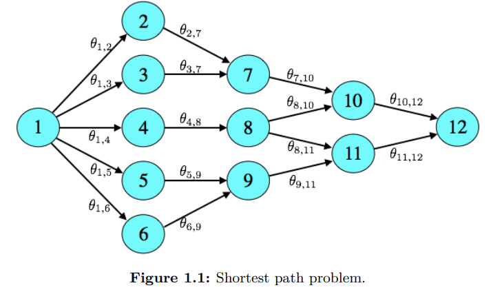
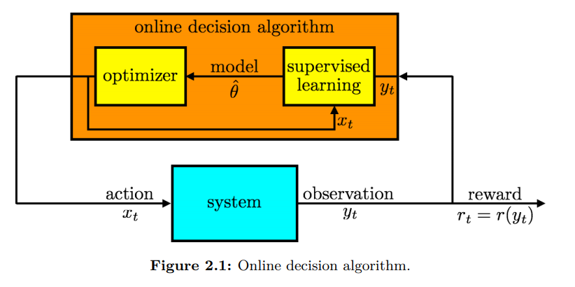
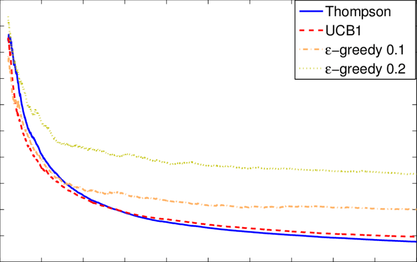

# Multi-Armed Bandits#2 Thompson sampling(1)

Thompson sampling에 대해서 포스팅을 나누어 작성하려고한다. 이번 포스팅은 intro에 설명했던 greedy 알고리즘과 Thompson sampling을 한번 비교해보려고 한다.

## Bernoulli bandit

우리가 선택할 수 있는 대안이 K개 있다 $k \in \{1,2,..,K \}$. 카지노를 예를들면 K개의 슬롯머신이 있는 셈이다. 우리가 슬롯머신 하나를 골라 게임을 진행하면 '성공' 또는 '실패'의 보상을 받는다고 하자. 각 K개의 슬롯머신에서 '성공'의 확률은 $ 0 \le \theta_k \le 1$  이고 슬롯머신 K개의 성공확률의 집합은 $(\theta_1,..\theta_K)$ 이다. 하지만 우리는 성공확률을 모르는 상황이다. 그렇기에 실험을 통해서 찾아나가야 한다. 우리의 목표는 T의 기간동안 누적 성공횟수를 최대화하는 것이 목적이다.

웹사이트 광고를 예를들면, 광고의 종류가 여러개가 있고 어떤 광고를 보여주었을 때 사용자들이 클릭을 많이하는지, 다시말하면 사용자 대비 광고를 클릭한 사용자 수를 위에서 설명한 $\theta_k$  같은 것으로 생각할 수 있다. 

간단하게 접근하는 방법은 특정 기간동안 모든 광고에 대해 동일한 확률로 사용자들에게 보여주어 정보를 수집한후, 수집한 정보를 토대로 가장 높은 확률을 보인 광고를 선택하여 홈페이지 배너에 게시하는것이다. A/B 테스트와 같은 전략이다.

문제는 exploration과 exploitation 사이의 밸런스이다. 너무 짧은 기간동안 정보를 수집해 의사결정을 내리면 잘못된 의사결정을 내릴 수 있다. 반대로 정보수집 기간이 너무 길면, 변화를 빨리 적용시키지 못해 발생하는 손해가 클 수 있다. 적절한 밸런스를 맞추어야 하는데 그 **'적절한'** 밸런스는 실제로 모르거나 달성하기 어려운 경우가 많다.

우리는 노드1 에서 출발하여 노드12 로 도착하는 가장 빠른 경로를 알고 싶다. 하지만 어떤 경로가 가장 빠른지 우리는 모르는 상황이다. Bernoulli-bandit의 경우, 새로운 슬롯머신이 하나 추가되면 모수가 단순히 하나가 늘어난다. 하지만 이 경우 노드 하나가 추가되면 늘어나는 경로는 기하급수이다. 계산의 측면에서 challenging하게 된다.

앞으로 설명할 **Thompson sampling**은 이러한 면에서 세련되고 유연한 알고리즘이다.알고리즘은 처음 등장한 것은 1933년인데 수렴에 대한 증명 등 실제로 검증이 되어 사용이 되기 시작한것은 그리 오래 되지 않았다(아마 2010년 경). 

## greedy decision

**'greedy'** 알고리즘은 단순하고 가장 일반적인 방법론이다. 앞서 설명한대로 1)과거데이터를 통해 모델을 평가하고 2) 최적의 모델을 사용하는 과정이다. supervised-learning과 같다. 데이터와 레이블 쌍 ($x_t$,$y_t$) 이 존재하고 이 데이터를 통해서 우리가 알고싶은 모수 $\theta_t$를 추정한다.

슬롯머신의 예로 돌아가면 매 시간 t 다 각각의 슬롯머신의 성공 확률 $(\theta_1 ..\theta_k)$ 를 계산하고 가장 높은 $\theta_k$를 가지는 슬롯머신을 선택해 게임을 진행한다. 이 경우에는 보상이 성공:1 , 실패:0 인 경우 이기에 확률을 비교하여 선택하지만 엄밀히 말하면 **$\theta_k$ x 성공보상**  이 가장 높은 슬롯 머신을 택하는 것이다.(평균 보상)  성공보수가 1이라고 하면 성공횟수/시행횟수 를 통해서 해당 슬롯머신의 성공확률을 계산할것이다. 그 후 최적의 확률을 가지는 슬롯머신을 선택하고 게임을 진행하며 보상을 받고 이 정보를 다시 다음 t 에 사용하여 확률을 계산하는 식으로 진행된다.

예를 들어보자. 3가지의 action 선택지가 있다.(3개의 슬롯머신) 우리는 action1,action2 는 각 1000번, action3는 5번 탐험을 했다.(exploration) 그리고 누적된 성공보상은 각 600,400,2 이다. 이 경우에 우리는 action1과 action2에 대해서는 평균 기대 보상이 각 0.6, 0.4에 가까울 것이라는 강한 확신을 가질 수있다. 하지만 action3의 경우는 탐험 횟수가 부족해서 섣부르게 결정하지 못하는 높은 불확실성이 존재한다.

이러한 예 에서 greedy 알고리즘은 action1 을 선택할 거이다. 왜냐면 기대평균이 가장 높으니깐(0.6)...!  $\theta_2> \theta_1$ 이라고는 결정하기 힘들것이다. 왜냐면 600,400번의 경험이 있고 기대 평균이 좀처럼 바뀌지 않을 것이기 때문이다.문제는 $\theta_3 > \theta_1$ 의 경우다. 이게 실제와 같다면 문제가 되지 않지만 경험 횟수가 적어서 불확실성이 큰 상황에서 greedy 알고리즘은 항상 $\theta_1$ 만 택할 것이기 때문에 좀처럼 $\theta_3$ 대한 학습을 하기 힘들것이다. (기대평균이 각각 0.6, 0.4이기때문에 같은 이유로 $\theta_1$ 만 선택.)

이를 보완하고자 나온게 **&epsilon; - greedy** 알고리즘이다. 서두에 이야기했던 exploration과 exploitation 간의 밸런스를 미리 정하는데 &epsilon; 확률만큼은 exploration에, 1-&epsilon; 확률만큼은 exploitation에 할애한다. exploration(탐험) 할 때에는 K개의 슬롯머신 중 랜덤하게 하나를 고르고 exploitation(착취)할 때는 기대평균을 계산해 가장 높은 슬롯머신을 선택해 게임을 진행한다. 다시 action1,2,3 을 선택하는 문제로 가보자. 탐험시에는 균일한 33.3% 확률로 action을 선택하게 되는데 action2의 경우는 더이상 최적화될 여지가 없어보임에도 선택하는 경우가 발생하고 더많은 탐험이 필요한 action3에는 동일한 확률만큼만 부여 되어 비대칭의 문제가 해결되지도 않는다.

## Thompson sampling

**Thompson sampling**의 작동을 보기위해 이전과 마찬가지로 Bernoulli bandit를 생각해보자.  우리에게는 K개의 action 선택지가 있고(K개의 슬롯머신)  , 각 K는 저마다의 성공확률(보상확률) $\theta_k$ 가 있다. 성공보수가 1인경우, $\theta_k$ 는 *성공확률* 이자  *평균보상* 으로 생각할 수 있다. 하지만 우리는 모르는 값이다. 처음의 time step에서 K개중 하나를 고르는 행위인 $x_1$ 을 할것이고  그에 따른 보상은 $r_1 \in \{0,1\}$  이다. 이를 확률로 나타내면$P(r_1=1|x_1,\theta)=\theta_{x1}$ 이다. 이후 순차적으로 $x_2$를 선택하고 $r_2$를 보상받으며 계속 진행될것이다.

K개의 미지의 성공확률 $\theta_k$ 에 대해서  prior을 부여해야하는 단계이다. 우리는 아무런 정보가 없기 때문에 확률변수가 범위 (0,1) 사이를 가지는 beta 분포를 선택할것이고, beta분포가 가지고 있는 hyper parameter 인 $\alpha_k , \beta_k$ 는 K개의 개수만큼 각각 존재한다. 자 이제 prior pdf는 정해졌고 수식으로는 다음과 같다.
$$
p(\theta_k) = \frac {\Gamma(\alpha_k + \beta_k)} {\Gamma(\alpha_K)\Gamma(\beta_k)}\theta_k^{\alpha_k-1}(1-\theta_k)^{\beta_k -1}
$$
 beta 분포를 고른 이유는 지금의 예 처럼 **확률**을 다루기에 적합한 분포이기도 하지만 conjugate한 성질을 만족하기 때문에 계산상의 이점이 있기 때문이기도 하다. 매 time step마다 선택하는 action에 따라 다음과 같이 parameter가 업데이트 된다.
$$
(\alpha_k, \beta_k) \leftarrow 	
\begin{cases}
(\alpha_k, \beta_k) & \text{if } x_t \ne k  \\
(\alpha_k, \beta_k) + (r_t, 1-r_t) & \text{if } x_t = k
\end{cases}
$$

beta 분포는 평균이 $\alpha_k/(\alpha_k + \beta_k)$  이고,  $(\alpha_k + \beta_k)$ 의 횟수가 증가할수록 평균에 집중되는 형태인 샤프한 분포를 가지게된다.

greedy 알고리즘과 Thompson sampling의 차이는 한 가지이다. 전체적인 흐름은 다음과 같다.

1. `**모수를 추정한다 / 모수를 샘플링 한다.**`
2. 개중에 가장 높은 모수를 가지는 action을 선택해 게임을 한다
3. action의 결과로 얻은 보상을 토대로 모수를 update한다.
4. 반복

차이점은 1번 단계이다. **greedy** 알고리즘은 모든 K개의 모수를 다 계산한다. 위의 베타분포의 문제에서  각 K개의 슬롯에 대해서 평균인  $\alpha_k/(\alpha_k + \beta_k)$   를 계산한후 가장 확률이 높은 슬롯을 선택하는 반면, **Thompson sampling**은 해당 분포에서 샘플링을한다 $\theta_k \sim beta(\alpha_k, \beta_k)$ .  아까 제기되었던 문제점, 지배적인 기대확률에 의해 좀처럼 다른선택을 하지 않고 action 1만 선택하는 문제점에서 벗어날 수 있을 뿐만 아니라, 균등하게 뽑는 &epsilon; -greedy 에서 낭비되던 action2의 선택도 차츰차츰 분포가 업데이트 되어가며 그 기대확률이 실제확률에 수렴하게 되어 낭비를 줄일수 있다.

## regret

regret은 최적의 의사결정시의 평균보상과 현재시간에서 개인이 선택한 의사결정의 평균보상과의 차이를 의미한다. regret이 크면 최적의 의사 결정보다 평균보상이 많이 작다는 의미이므로 이 **'regret'** 을 줄여나가는것이 목적이라고 할 수 있다.
$$
regret_t(\theta) = max_k\theta_k-\theta_{x_t}
$$

알고리즘간의 regret을 비교하여 더 나은 알고리즘을 선택하는 것이 합리적인 선택이다.
