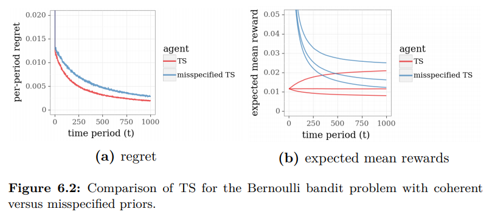

# Multi-Armed Bandits#3 Thompson sampling(2)

모델링에서의 고려할 점들 몇가지가 있다.

## prior 선택.

적절한 prior distribution을 선택하는 것은 중요하다. 적절하게 잘 선택하면 빠르게 최적에 도달하지만 그렇지 못하면 한참을 둘러서 갈 수도 있다. 실제 비지니스에서 이런 점은 상당히 크다. 시간을 줄임으로써 비용을 최소화 할 수 있기 때문이다. 실제 모델링의 과정에서도 마찬가지이다.  사전정보가 없을 때 무작정 uniform 또는 beta 분포를 선택하는 경우 샘플링이 제대로 되지않거나 수렴하지 않는 경우도 아~~주 빈번하게 경험할 수 있다.(ㅠㅠ) 

왼쪽은 uniform 분포와 beta 분포를 비교한 것이다. uniform 분포는 무난하지만 최적의 분포가 아니기 때문에 수렴의 속도가 늦다.

오른쪽 그림의 빨간선은 각각  beta(1,50), beta(1,100), beta(1,200) 에서 샘플링한 결과를 보여준다. 보여주는 대로 같은 beta분포라도 어떤 hyper-parameter를 선택하는지에 따라서 퍼포먼스가 다르다. 

## Nonstationary system

지금까지는 모수 $\theta$ 가 고정되어 있다고 가정해왔다. 하지만 시간에 따라서 모수가 변화하는 시스템이 존재할 수도 있고 그런 시스템이라면 exploration(탐험)의 과정은 끊임없이 지속되어야 한다. 

이런 시스템에 대해서 적용할 수 있는 가장 간단한 방법은 과거의 관측치를 잊어버리는 것이다. 특정 기간의 과거기록만 사용하고 그 기간이 지난 오래된 과거는 사용하지 않는 방법이다.

과거의 기록들을 $H_{t-1} = ((x_1,y_1),...,(x_{t-1},y_{t-1}))$  이라고하면
$$
(\alpha_k, \beta_k) \leftarrow \begin{cases} ((1-\gamma)\alpha_K + \gamma \widehat{\alpha}, (1-\gamma)\beta_k + \gamma\widehat {\beta}),  & x_t \ne k \\
((1-\gamma)\alpha_K + \gamma \widehat{\alpha} + r_t, (1-\gamma)\beta_k + \gamma\widehat {\beta} + 1-r_t) & x_t = k \end{cases}
$$

## reference 

https://web.stanford.edu/~bvr/pubs/TS_Tutorial.pdf
