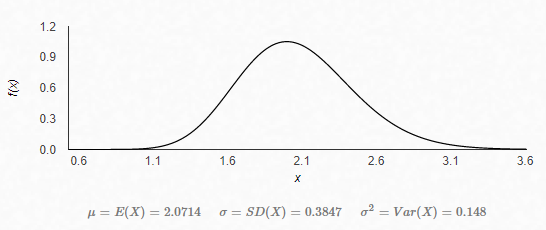

# Bayesian inference for Poisson data

​	조산으로 일찍 세상에 나온 아이들은 보통 몇일을 병원에서 보낼까?  XX병원에 온 산모 14명은 예정보다 일찍 출산을 하게 되었다. 아이들이 병원에서 보낸 일수를 **y** 라고 할때 각 아이들의 데이터는 다음과같은 벡터로 나타낼 수 있다.
$$
y=[1,2,1,1,1,2,2,4,3,6,2,1,3,0]
$$

조산으로 인해서 병원에서 보내게 되는 시간은 어떻게 추정할 수 있을까??  주어진 시간 범위내에서 특정 횟수의 사건이 일어날 확률 말이다. 양의 정수인 데이터(주로 count) 를 다룰수 있는 분포의 형태중 대표적인 것이 바로 '**Poisson**' 분포이다. 포아송 분포는 이항분포아 유사한 특징을 가진다. 예를들면 이산형(discrete) 함수 이고 양수만 가진다는 특징처럼. 둘을 비슷해보이는데 조금 다르다. 이항분포의 경우는 특정 독립시행 횟수 'n'이 존재하고 각각의 n은 성공확률 'p'를 가진다. 반면 포아송 은 이론상 무한한 시행횟수를 가질 수 있고 그렇기 무한한 성공횟수를 가질 수 있다. 주어진 시간 범위내에서 어떤 사건은 1번이 일어날수도 100번 1000번이 일어날 수도 있다. 이항분포는 이와 다르게 주어진 'n'의 범위내에서만 (성공)사건이 발생할 수있다는 제약이 있다.

포아송분포는 대개 어떤 긴 시간 내에서 좀처럼 발생하지 않는 사건들을 다루는데 주로 사용된다. 이 말인 즉, 이항분포의 관점에서는 아주 많은 시행횟수 'n'을 가지면서 성공확률이 아주작은 'p'인 경우와 비슷하다(다만 포아송 분포는 n과 p를 모른다).

포아송 분포의 기본정의는 아래와 같다.

$$
P(Y_i=y_i|\lambda) = \begin{cases} \frac {\lambda^{y_i}e^{-\lambda}} {y_i!} \qquad \mathbf {for} \space y_i=0,1,.. \\ 0 \qquad otherwise\end{cases}
$$

포아송분포는 평균과 분산이 모수와 같다.
$$
\begin{matrix}
E[y] &=& \lambda \\
Var[y] &=& \lambda
\end{matrix}
$$

**베이지안 관점**에서의 분석이라고 하면 이렇게 likelihood가 주어졌을 때 사전분포인 prior을 통해서 사후분포를 추론하는것이라 할 수 있다. normalizing constant를 제외하고 사후분포는 다음과같이 prior과 likelihood의 곱의 비율로 나타낼 수 있다.

$$
p(\lambda|y) \propto p(y|\lambda)p(\lambda)
$$

likelihood 함수로 포아송분포의 곱을 가지고 있다고 한다면 사전분포 prior은 어떻게 선택하면 좋을까. 현재 우리의 likelihood의 형태는 다음과 같다.
$$
\begin{matrix}
p(y|\lambda) &=& \prod^n_{i=1} \frac {\lambda^{y_i}e^{-\lambda}} {y_i!}\\
&\propto& \lambda^{n \bar{y}} e^{-n\lambda}
\end{matrix}
$$
관측치는 주어져있는 값이기 때문에 상수와도 같다. 그렇기에 위 처럼 $y_i$ 가 생략된 비율의 형태를 가지게 된다. likelihood와 같은 family 형태의 prior을 선택하면 좋을 것 같다. 지수분포는 그 형태가 $\lambda e^{-\lambda x}$ 로 지금의 likelihood와 유사하다. 지수분포의 형태를 써도 되지만 지수분포가 $Gamma$ 분포의 특별한 형태임을 안다면 감마분포를 쓰는것이 일반화하기에 조금더 수월할 것이다.
$$
X_i \sim exp(\lambda) \Leftrightarrow X_i \sim Gamma(1,1/\lambda)
$$

감마분포의 정의는 아래와 같다.
$$
f(x;\alpha,\beta) = \frac {\beta^{\alpha}x^{\alpha-1}e^{-\beta x}} {\Gamma(\alpha)} \qquad ,\Gamma(\alpha) = (\alpha-1)!
$$

likelihood함수의 형태를 보고 우리는 $\lambda \sim Gamma(\alpha,\beta)$ 형태인 감마함수를 우리의 prior로 정하려고한다. 이에 따른 사후분포를 다시보면 다음과같다.(모수 $\lambda$와 관련없는 부분들은 상수이기 때문에 생략. 비율로 나타내기 때문에)
$$
\begin{matrix}
p(\lambda|y) &\propto& p(y|\lambda)p(\lambda) \\
&\propto& \lambda^{n \bar{y}}e^{-n\lambda}\lambda^{\alpha-1}e^{-\beta\lambda} \\
&=& \lambda^{\alpha+n\bar{y}-1} e^{-(\beta+n)\lambda}
\end{matrix}
$$

포아송분포와 감마분포는 conjugate 성질을 가진다. 따라서 사전분포와 사후분포의 형태가 같은 감마분포가 우리의 사후분포가 될 것이다.$\lambda|y \sim Gamma(\alpha+n\bar{y},\beta+n)$

이제는 사전분포에 들어갈 hyper-parameter들을 정해야된다. hyper parameter인 $\alpha,\beta$ 의 값에 대해서 어떠한 정보가 없기 때문에 보통 non-informative한 prior을 가지도록 넣어주면 되는데 'jeffrey's prior'을 이용해서 한번 넣어보자. Jeffrey's prior은 변수변환에 강건한 prior로 어떠한 상황에서도 non-informative한 성질을 가지도록 해준다. Jeffrey's prior은 fisher information을 통해 구할 수 있다.

$$
\begin{matrix}
\mathbf{log}p(y|\lambda) &=& -\mathbf{log}(y_i!)+y_i\mathbf{log}(\lambda)-\lambda \\
d\mathbf{log}p(y|\lambda)/dy &=& y_i/\lambda -1 \\
d^2\mathbf{log}p(y|\lambda)/d\lambda^2 &=& -y_i/\lambda^2
\end{matrix}
$$

$$
\begin{matrix}
I[\lambda] &=& -E[\frac {d^2 \mathbf{log} p(y|\lambda)} {d \lambda^2}|\lambda] \\ &=& E[y_i/\lambda^2|\lambda] \\
&=& \lambda/\lambda^2 = 1/\lambda
\end{matrix}
$$

$$
Jeffrey's \space prior = \sqrt {I[\lambda]} = 1/\sqrt{\lambda}
$$

우리가 구한 jeffrey's prior은 $1/\sqrt {\lambda}$ 이고 이는 improper한 $Gamma(1/2,0) $ 와 동일하다고 한다. 

사실 이과정이 잘 이해가 되지는 않는데 jeffreys prior을 구한 결과값과 비슷하게 생긴 감마분포의 파라미터를 선택하는건지 잘 모르겠고 또 다른 참고자료에서는 Gamma(0.001,0.001)을 jeffreys prior이라고 하던데 두 경우가 다른건지 잘 모르겠다.

감마분포의 $\alpha, \beta$ 값은 0보다 항상 커야한다.이론상으로 0을 가질수 없다. jeffrey's prior로 찾은 Gamma(1/2,0)의 경우 $\beta$가 0 이라기보다 0과 가까운 아주 작은 값이라고 생각하면 된다.(Gamma(ϵ,ϵ)). 사후분포에서 $\alpha,\beta$ 모두 업데이트 되기 때문에 $\beta$를 0이라고 생각해도 문제되지 않는것 같다.(아닐수도 있음)

처음 예제의 y 사후분포를 구하면 다음과 같다.

$$
\begin{matrix}
posterior &=& Gamma(\alpha+n\bar{X},\beta+n)\\
&=& Gamma(1/2 + \sum y, 0+14) \\
&=& Gamma(29,14)
\end{matrix}
$$

형태는 다음과같다.

결과 조산으로 일찍 세상으로 나온 아이들은 보통 2일정도를 병원에서 머문다고 할 수 있다. conjugate 성질을 이용하여 포아송데이터를 쉽게 다룰 수 있었다.

## reference

https://www.youtube.com/watch?v=lNrpPNk6InU

