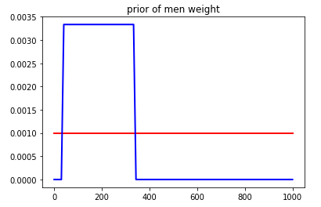

# Prior 1. non-informative prior

오늘의 포스팅은 베이지안 프레임웍 에서의 prior distribution 중 *uninformative* 와 *informative* 에 대해서 이야기 해보려고 한다.

베이지안 통계학은 단순히 관측치로만 추론을 하지 않는다. 관측치와 내가 가지고 있던 사전 정보를 **절충하여** ''사후분포(posterior)' 하 하는 추론의 결과를 만들어낸다.

베이지안의 특징중 하나는 연구자의 주관적인 사전 정보를 이용하는데 있다고 하는데, 도대체 이게 뭘까? "사전 정보를 사용한다"라고만 하면 상당히 모호한 말이고 조금더 구체적으로 이야기하면 

* 사전 정보는 모수(파라미터)에 대한 정보이다.
* 그 정보는 경험에 근거한 분포를 가정하는것이다.

베이지안의 세계에서 사전정보를 이용한다는 것은, **모수가 특정 분포를 따른다고 가정** 하는 것이다.

예를들면, 동전을 던졌을 때 앞면이 나올 확률이 알고 싶은 상황에서 앞면이 나올확률(p)는 우리가 알고 싶은 모수이다. 그리고 우리는 경험적으로 동전 앞뒤가 나올 확률은 거의 비슷해서 각각 0.5  , 0.5 수준에서 형성될거라고 알고있다.  그렇기에 앞면이 나올 확률은 평균이 0.5에 분산이 0.01인 정규분포라고 가정하는 것이 사전 정보를 이용하는 것이다.
$$
p \sim N(0.5,0.01)
$$

## uninformative vs informative

​	이런 경우가 있을 수 있다. 내가 알고 있는 사전 정보가, 그러니깐 어떤 모수의 분포에 대한 나의 확신이 강할 수도 있고 약할 수도 있다. 확실하게 어떤 모수에 대해서 잘 안다면 그 정보를 사용하면 된다. 이런 경우의 prior를 **informative** 하다고 할 수있다.  하지만 정보가 없거나 확신이 약한 경우도 분명히 생기기 마련이다. 이런 경우에는 어떻게 해야 할까?

#### non-informative prior

**대개 flat-prior, reference-prior, diffuse-prior, vague prior 등과 동의어로 쓰이는데 이런 구분에 대해 논쟁에 조금 있는 것 같다. 아주 간단한 형태의 flat-prior에 대해서만 이야기해보겠다.

​	내가 가진 확신의 정도가 낮을 때 사용하며 이름을 통해서 알 수 있듯이 정보량이 크지않은 prior 이다. 대개 '변수가 양수 혹은 음수' 라던지 '변수의 boundary' 등과 같은 객곽적인 정보만을 담은 prior을 사용하거나 **principle of indifference** ,즉 모든 가능성에대해 동일한 확률을 부여한걸 사용한다. 모수를 추정함에 있어서 이런식의 **non-informative prior** 사용하는 것은 결과적으로 통상적인 MLE로 추정하는것과 크게 다르지 않다. 그렇기에 prior에 대한 확신이 없다고 해서 베이지안 프레임을 사용하지 못하는 거은 아니다.

이런 *non-informative prior*을 사용했을때는 다음과 같은 특징을 요약하면 다음과 같다.

* 정보량이 없는(적은) prior 이다.
* posterior(사후분포)에 영향을 적게 끼친다.
* data 를 통한 추론의 영향이 커진다.

**flat prior**

위에서 이야기한 non-informative prior 분포는 어떤 모양일까? 모든 가능성에 대해 동일한 확률을 가지는 prior이다.수식으로 나타내면 flat prior의 경우는 constant 하게 나타내어진다
$$
f(\theta) \propto c
$$

베르누이 시행의 경우 확률 p에 대해 flat한 prior을 가지고 있다면 0과 1사이의 uniform 분포일 것이다.
$$
p \sim U(0,1)
$$

이렇게 모든 가능성에대해 동일한 확률값을 가지는 prior이라면 posterior은 절대적으로 data의 likelihood에 의해 결정될것이다.

$$
posterior \propto likelihood \times prior \\
posterior \propto likelihood \times constant \\
posterior \propto likelihood
$$

flat한 형태라고 해서 다같은 형태는 아니다.어떤 경험적인 임계치는 가지고 있는 경우도 있다. 예를들어보자.

키 180의 성인 남자의 몸무게의 posterior을 알고싶다. 하지만 나는 어떠한 정보도 가지고 있지 않다.그렇다면 모든 확률에 대해서 flat-prior을 사용하면 간단하다. 그러면 이론적으로 양의방향으로 동일한 infinite한 prior가 될것이다. 하지만 사실 이 prior은 말이 안된다(improper prior). 인간이 가질수 있는 몸무게는 정확한 수치는 모르지만 경계가 분명이 있을것이다. 그런경우는 다음과 같은 부분적으로 flat한 형태가 될것이다.

## summary

prior를 선택함에 있어서 자신이 아는 정보가 있으면 사용하면 된다.  prior에 대한 사전 정보가 없거나 잘못된 정보에 대한 영향을 줄이고자 무차별적인 prior을 사용하고 싶으면 정보량이 많지 않은 non-informative prior을 사용하면 된다. non-informative한 prior을 가지고 추론하는 경우는 MLE와 크게 다르지 않을것이다.

## reference

https://en.wikipedia.org/wiki/Prior_probability

https://stats.stackexchange.com/questions/7497/is-a-vague-prior-the-same-as-a-non-informative-prior
