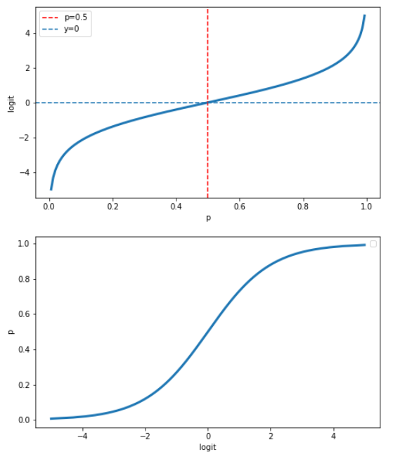
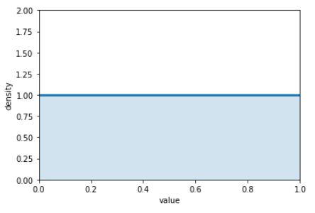
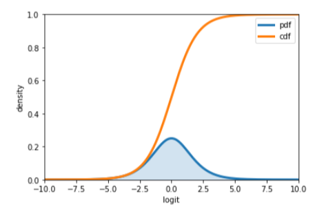

# prior #2. jeffreys prior


이전 posting 에서는 일반적인 형태의 non-informative prior에 대해서 이야기를 했었는데 이번 포스팅은 조금 특별한 non-informative prior을 소개 하려고 한다.


## intro.


​	베이지안 프레임웍을 통해 추론을 하기 위해서는 사전분포 prior에 대한 정보가 필요하다. 앞선 포스팅에서 설명했듯이 내가 가진 사전정보에 대해 확신하지 못한다면 정보량이 적은 non-informative-prior을 사용하는 것이 일반적이다. 

불확실성에 대한 대응으로 무차별한 prior을 사용하는 것이 오히려 **정보의 왜곡**을 가져오는 경우가 있다.역설적이게도 정보가 없기를 바라는데 정보가 생겨 버리는 그런상황이다.  왜 그럴까? 모든 가능성이 동일한 사전정보를 이용한다는 것은 나의 사전정보의 편향이 없고 관측된 데이터로 추정을 하게 되는것인데 어째서 정보의 왜곡을 초래하는 것일까?


## problem.

​	

​	우리는 출생률에 관한 연구를 하고있다. 새로 태어난 아이가 남자아이일 확률을 'p' 라고 해보자.  지금 우리는 남자아이의 출생률에 대해서 어떠한 정보도 가지고 있지 않다.  이런 경우 [0,1] 사이의 범위에서 동일한 확률을 가지는 'uniform pdf'를 사용하는 것이 꽤 설득력 있는 분석의 시작처럼 보일수 있다. 하지만 여기에는 문제가 숨어 있다.

우리는 아주 빈번하게 로지스틱(logistic regression) 모형을 이용한다. 로지스틱 모형은 일반선형모델(GLM)에서 'logit' link function을 이용하여 (-$\infin$ , $\infin$) 의 값을 (0,1) 의 공간으로 mapping 시켜준다. 

```python
import numpy as np
import matplotlib.pyplot as plt

p = np.linspace(0,1,150)
y = np.log(p/(1-p))
fig, ax = plt.subplots(2,1, figsize=(8,10))
ax[0].plot(p, y, lw=3)
ax[0].axvline(x=0.5 ,ls='--' ,label='p=0.5' ,c='red')
ax[0].axhline(y=0 ,ls='--' ,label='y=0' )
ax[0].legend()
ax[0].set_xlabel('p')
ax[0].set_ylabel('logit')

ax[1].plot(y,p, lw=3)
ax[1].legend()
ax[1].set_xlabel('logit')
ax[1].set_ylabel('p')
```



 logit  &tau; = $log \frac {p} {1-p}$  은 이러한 이유로 베르누이 확률의 변수변환으로 알려진 대표적인 것(?) 이라고 할 수 있다. 또 단조증가(monotone increasing)함수 이기 떄문에 1대1 매칭이 가능해져서 회귀모형에서 logit 변형이 가능한것이다. 

출생률의 관한 예로 돌아가면, 나의 경우는 단순히 확률 'p'에 관심이 있지만 다른 연구자들은 'p' 보다는 회귀식을 이용하려는 이유 혹은 다른 이유로'$log \frac {p} {1-p}$' 를 추정하고 싶어할 수도 있다. 

동일한 이유로, 우리가 모수 'p' 에 대하여 아무런 선호를 표현하고 싶지 않다면 마찬가지로  logit &tau; 도 어떤 편향을 가지고 있다고 생각하면 안될것이다.  &tau; = &tau;1 라던지 또는 &tau;=&tau;2  와 같이 특정한 값을 선호하지 않는다 왜냐면 우리는 잘 모르니깐!  

자 우리는'p' 에 대해서 다시 생각해보자. 남자아이일 확률인 'p'에 대해서  [0,1]의 uniform prior을 선택했다. uniorm 분포이면서 당연히 적분의 값은 1이다.
$$
\gamma_p(p) = 1, \space p\in[0,1]
$$

```python
import numpy as np
import matplotlib.pyplot as plt
x = np.linspace(0,1,150)
y = np.linspace(1,1,150)
lines = plt.plot(x, y, lw=3)
plt.fill_between(x, 0, y, alpha=0.2, color=lines[0].get_color())
plt.autoscale(tight=True)
plt.xlabel('value')
plt.ylabel('density')
plt.ylim(0,2)
```




 이를 logit으로 변수변환 하면 logit &tau; = $log \frac {p} {1-p}$  이고 이제 모수는 logit &tau;이다.  p를 &tau;에 관한 식으로 나타내면 
$$
p = \frac {1} {(1+exp(-\tau))}
$$

$h(\theta) = \tau $ 이고 $h^{-1}(\tau) = \theta$ 이다.  g(&tau;) = U($h^{-1}( \tau)$) |J(&tau;)|, J는 자코비안 transform 이다.


```python
psi = np.linspace(-10,10,150)
y1 = np.exp(psi)/(1+np.exp(psi))**2 # cdf
y2 = 1/(1+np.exp(-psi)) # pdf
lines1 = plt.plot(psi, y1, lw=3, label='pdf')
lines2 = plt.plot(psi, y2, lw=3, label='cdf')
plt.fill_between(psi, 0, y1, alpha=0.2, color=lines[0].get_color())
plt.autoscale(tight=True)
plt.xlabel('logit')
plt.ylabel('density')
plt.ylim(0,1)
plt.legend()
```



어떠한 선호를 나타내지 않기 위해 선택한 uniform prior가 logit &tau; 로 변환했을 때는 0의 부근에서 높은 확률을 가지는 prior 로 바뀌어 버렸다. **모수에 대해 차별적인 정보가 생겼다!**


## Jeffrey prior.

​	

​	문제는 이렇다. non-informative prior을 선택하는 경우 변수변환(change of variable)에 의해서 없던 선호가 생겨버리는 것이다. 모수 공간이 discrete 하거나 finite한 경우에 monotone transform에서도 강건하게 선호를 가지지 않는데,  모수공간이 continous 한 경우에는 uniform 분포의 무차별성이 global하게 받아들여지지 않는다. monotone transform의 경우 invariant한 특징, 모수변환에 상관없이 동일한 정보를 가져야한다는 특징이 사라지는 것이 문제이다.

p에 대해 uniform prior을 사용하는 경우 [0,1] 모든 범위에서 동일한 확률을 가진다. 정보량이 무차별적이다. p와 &delta; 는 one-to-one 대응이 되고 p가 가지는 정보량 만큼 &delta;도 동일하게 가져야 한다. 이것이 **'invariance property'**이다. change of variable로 그 형태가 바뀌어도 동일한 정보량을 가져야 한다.

 어떠한 상황에 상관없이 **global** non-informative prior은 없을까. **Jeffrey prior** 은 이러한 문제를 해결해 준다.  모수 &theta; 에 대해서 prior 분포 $\delta_{\theta}(\theta)$ 를 가정해보자. 이제 모수를 monotone transform 시켜서 $\delta = h(\theta)$ 로 바꿔보자. 

1. 원래의 모델 : $X \sim f(x|\theta),\space \theta \in \Theta $ 
2. 변수변환 모델 : $X \sim g(x|\delta), \space \delta \in \xi, \space g(x|\delta)=f(x|h^{-1}(\delta)) \space and \space \delta=h(\Theta)={h(\theta) : \theta \in \Theta} $ 


**Jeffrey prior pdf**은 모수들의 집합 &theta;  에 대해서 다음과 같이 정의된다.
$$
\pi(\theta) \propto \sqrt {detI(\theta)}
$$
I 는 fisher information 이고 다음과 같이 정의될 수 있다.
$$
I_{ij}(\theta) = -E[\frac {\partial^2 lnL} {\partial \theta_i \partial \theta_j}]
$$


reparameterization 된 모수 사전분포가 다음과 같을 때
$$
p(\delta) \propto \sqrt {I(\delta)}
$$
원래 모수의 사전분포 $p(\theta) \propto \sqrt{I(\theta)}$ 로 부터 도출할 수 있다.
$$
\begin{matrix}
p(\delta) &=& p(\theta)|\frac {d\theta} {d\delta}| \\
&\propto& \sqrt {I(\theta)(\frac {d\theta} {d\delta})^2}=\sqrt {E[(\frac {dlnL} {d\theta})^2](\frac {d\theta} {d\delta})^2} \\
&=& \sqrt {E[(\frac {dlnL} {d\theta} \frac {d\theta} {d\delta}^2)]} = \sqrt {E[(\frac {dlnL} {d\delta})^2]} \\
&=& \sqrt {I(\delta)}
\end{matrix}
$$


Jeffrey's prior 이 왜 모수를 변환시키는 과정에서 invariant 인지 살펴보자. 우선 모수 &theta; 와 jeffrey's prior을 보면
$$
\pi(\theta) \propto \sqrt {-E[ \frac {\partial^2 ln L} {\partial \theta^2}]}
$$


사후분포는 likelihood 와 prior의 곱에 비례한다.
$$
p(\theta|x) \propto L(x|\theta)\pi(\theta) = L(x|\theta)\sqrt {-E[ \frac {\partial^2 ln L} {\partial \theta^2}]} = L(x|\theta) \sqrt {E[ (\frac {\partial ln L} {\partial \theta})^2]}
$$


이제 모수가 변수 변환으로 새로운 모수 $\delta(\theta)$ 를 가정하자. 그러면
$$
\begin{matrix}
p(\delta|x) &=& p(\theta(\delta)|x)|\frac {d\theta} {d\delta}| \\
&\propto& L(x|\theta(\delta)) \sqrt {E[ (\frac {\partial ln L} {\partial \theta})^2]} \\
&\propto& L(x|\theta(\delta)) \sqrt {E[ (\frac {\partial ln L} {\partial \theta} \frac {\partial \theta} {\partial \delta})^2]}
\end{matrix}
$$


반대로 시작부터 변화시킨 모수 $\delta$ 를 사용할 수있다. jeffrey'r prior을 베이즈 정리에 사용하면
$$
\begin{matrix}
p(\delta|x) &\propto& L(x|\delta)\sqrt{-E[\frac {\partial^2 lnL} {\partial \delta^2}]} \\
&\propto&  L(x|\delta)\sqrt{-E[(\frac {\partial lnL} {\partial \delta})^2]} \\
&\propto&  L(x|\delta)\sqrt {E[ (\frac {\partial ln L} {\partial \theta} \frac {\partial \theta} {\partial \delta})^2]}
\end{matrix}
$$
위의 식이랑 똑같은 결과를 도출할 수 있다. jeffreys prior을 사용하면 모수의 선택에 있어서 invariant한 특성을 보여준다.


## exmaple.


정규분포에서 샘플링 된 표본들이 있다. $X = (X_1, X_2,...,X_n)$ ,  $X_i \sim Normal(\mu,\sigma^2)$. 

관측치 하나에 대해서 &mu; 에 대한 피셔 정보(fisher information) 을 구해보면 다음과 같다.
$$
I_1^F(\mu) = -E[\frac {\partial^2} { \partial \mu^2} \frac {(X_1-\mu)^2} {2\sigma^2}] = \frac {1} {\sigma^2}
$$
따라서 &mu; 에 대해서 관측치 하나가 아니라  확률변수 X 의 피셔정보를 구해보면 
$$
I^F(\mu) = nI_1^F(\mu) = n/\sigma^2 = const, \space -\infin<\mu<\infin
$$
모든 모수 공간에서 상수형태로 나온다!. 하지만 이런 상수형태의 prior이라면 $\int_{-\infin}^{\infin} du = \infin$ . 따라서 improper prior이다.(범위가 무제한적인게 적합하지 않다는 의미) 

jeffrey's prior과 관련된 posterior은 
$$
\xi^J(\mu|x) = \frac {\exp \{-\frac {(\overset {-}{x} - \mu)^2} {2\sigma^2/n}\}} {\int_{-\infin}^{\infin} \exp \{ -\frac {(\overset {-}{x} - \mu^`)^2} {2\sigma^2/n}\}} = Normal(\overset {-}{x}, \sigma^2/n)
$$
proper pdf 형태로 나온다. 이경우 jeffre's prior은 acceptable함.

재밌는 점은 전통적인 방식의 추론이랑 제프리prior을 이용한 bayesian inference와 같은 결과를 준다는것. 평균값과 최빈값 은 $\overset {-}{x}$ MLE 추정으로 얻은 $\hat{\mu}_{MLE}(x) $ 와 같다. 100(1-&alpha;)% central posterior credible interval과 100(1-&alpha;)% 신뢰구간과 $\overset {-} {x} \pm \sigma z(\alpha)/\sqrt {n}$ . 


## summary


​	같은 data-set이라도 상황에 따라서, 또는 분석가에 따라서 관심사가 다를 수 있고 보고자하는 모수가 다를 수 있다.  **jeffrey's prior**은 서로다른 모수간의  변수변환(change of variable)에서도 해도 동일한 무차별성을 보여준다. 


## reference


https://stats.stackexchange.com/questions/38962/why-is-the-jeffreys-prior-useful

https://en.wikipedia.org/wiki/Jeffreys_prior