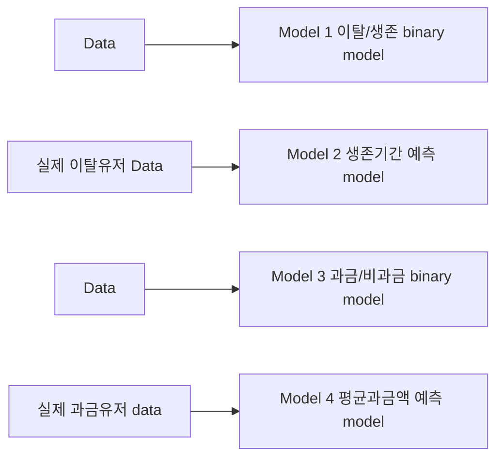
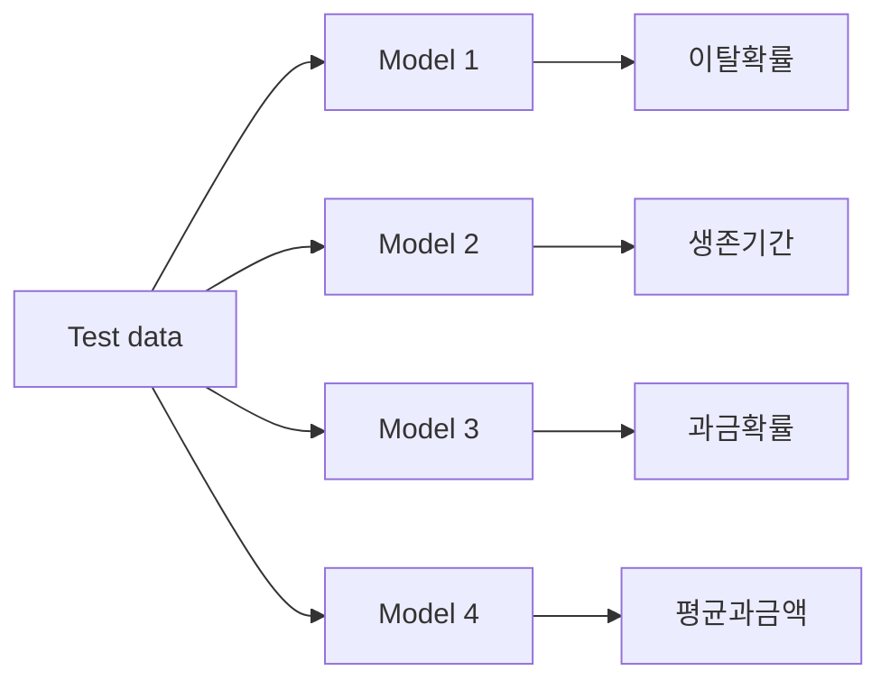
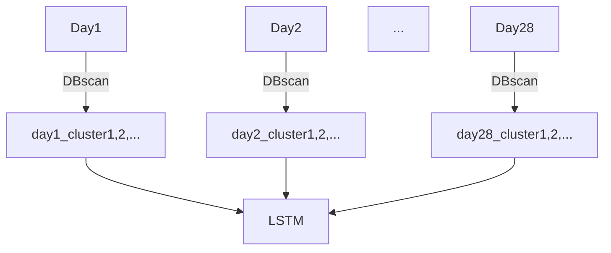

# <2019 빅콘테스트 게임 이탈/과금 예측 모형.>


2019년 빅콘테스트 챔피언스리그  게임이탈 모형.


* **분석대상** : NC soft 사의 대표작 '리니지'

  개인적으로 리니지를 해본적은 없지만 그간 알고 있었던 리니지에 대한 정보와 생각은 다음과 같다.``(**잘못된 정보일 수도 있고 상당히 주관적인 내용이니 skip하셔도 됩니다**.)``

  

  * 과금을 하는 유저가 상당히 많은 게임. 과금하지 않고는 제대로 된 플레이를 할수 없다라는 의견이 지배적.
  * 1세대 MMORPG 게임으로 역사가 깊고, 유저의 주 연령층은 3~40대. 
  * 신규 유저 유입이 거의 없는 고인물 게임. 반대로 매니아층은 상당히 두터움
  * 생계형 유저가 타 게임에 비해 많다. 
  * 거래되는 아이템의 가격이 상당히 고가이다. 집 한채와 맞먹는 아이템도 있다고 ...
  * 요즘의 타 게임에 비해 성격이 좀 다르다고 생각했다. 역사가 긴 게임인 만큼 유저들도 게임에 대해 애정을 가지고 플레이 하는것 같음. 
  * NC 사의 효자게임. 매출액이 상당히 많음.


* **데이터 및 문제 설명** : 예측 시점 이전 28일간의 데이터를 바탕으로 향후 70일동안의 유저의 생존기간 및 평균 과금액을 예측한다.

  

  * 64일동안 이탈하지 않는 유저는 생존으로 처리
  * 7일 연속 비로그인 유저를 이탈로 '간주' 함
  * 예측시점이후 발생한 고객별 총 결제금액을 생존일수로 나누어 평균 과금액 산출.
  * 이탈날짜(유저가 게임을 그만둔 날짜) 및 평균과금액(총결제액/생존기간)을 예측하는 것.
  * train_data / train_label : 학습시 사용하는 데이터.
  * test1 / test2 : train 데이터를 바탕으로 예측해야하는 데이터  -> test1_label, test2_label 을 예측해야함.
  * 평가는 1차적으로 제공하는 score 함수에 산출되어지는 기대이익으로 결정되며,  그 후 아이디어 및 논리성을 평가의 지표로 삼는다.

{:.center}


* **유의사항** : 해당 공모전 참가자들이 ''특히'' 고려해야하는 두가지를 주최측에서 강조하고 있는데 이는 

  

  1.  **Score 함수의 최대화** : 혼동할 수 있는데 이탈날짜 및 과금액을 정확히 맞추는것이 이 공모전의 본질이 아니다. 자칫 생각의 방향이 이탈 그 자체, 혹은 과금 그자체가 되어버릴 수도 있지만 본질은 제공하고 있는 score 함수의 최대화이다. score 함수는 구조를 간략하게 설명하면, 이탈과 동시에 과금이 예상되는 유저에게 인센티브(평균과금액에 따른 비율)를 제공하여 이탈을 방지함으로써 해당 유저의 기대이익만큼을 다시 확보할수가 있는데 이를 score로 나타낸 함수이다. 

     

  2. **시간변화에 강건한 모델**(time robust) : 대개 어떤 모델을 구축하고 나면 시간이 지남에 따라 모델의 성능이 저하되는데 그 이유로는 `concept drift` 를 들 수있다. 오늘 최대의 결과를 만들어 내는 요인이 한달 뒤에는 그렇지 않을수도 있는 것이다.  마치 살아있는 생물처럼 시간이 지남에따라 특성이 변화한다. 이렇게 *concept* 이 변화할 때마다 매번 모델을 새로 만드는 것은 상당히 시간과 비용이 드는 작업이다. 시간의 변화에 따라 바뀌는 *concept* 을 잘 대처하는 모델을 만드는 것이 중요하다.


---


## 제출모델

** 잘못 전달하는 정보들이 있을 수 있습니다. 피드백 주시면 수정하겠습니다. 비판적인 시각으로 봐주시면 감사합니다!


#### 	1. score 함수에 대해서.(중요)

​	*먼저 score 함수에 부터 시작해서 모델을 설명하고자 한다. Score 함수는 모델의 성능을 평가하는 척도로 사용되는 함수로 **아주아주** 중요하다... target 변수에 대해서 어떤 전략으로 접근해야하는지 에 대한 많은 단서를 주고 있다. score는 다음과 같이 구해지는데*


$$
Score = 잔존가치\times전환율 - 비용
$$


*여기서 각 요소들의 의미는*


* 잔존가치 : 잔존함으로써 자사에 안겨주는 기대이익.
* 전환율 : 이탈 예정고객이 인센티브에 반응하여 잔존하게 되는 비율
* 비용 : 이탈 예정고객에서 제공하는 인센티브.


*사실 이렇게 봐서는 잘 의미가 와닿지 않는다. 수식으로 살펴보는 것이 낫다. 수식을 구성하는 변수는 총 4가지다.*


​	S : 생존기간 	S_p : 예측생존기간

​	R : 평균과금액	R_p : 예측평균과금액


*그리고 수식을 `평균과금액` 기준에서  살펴보면,*


$$
과대평가시 score = 30 \times exp(-|S-S_p|^2/450)\times R - 0.03\times R_p
$$

$$
적정평가시 score =  30\times exp(-|S-S_p|^2/450)\times R - 0.03\times R
$$

$$
과소평가시 score = ((10/9)\times (R_p/R)-1/9)\times 30\times exp(-|S-S_p|^2/450)\times R - 0.03\times R_p
$$


*수식을 통해 알수 있는 것은*


* 생존기간

  * 정확하게 예측한 경우 --> (30 x 1 x R) - (0.03xR_p)
  * 7일 오차인 경우 --> (30 x 0.9 x R) - (0.03xR_p)
  * 14일 오차인 경우 --> (30 x 0.65 x R) - (0.03xR_p)
  * 21일 오차인 경우 --> (30 x 0.38 x R) - (0.03xR_p)

  -> `1)  exponential 함수의 특성상 오차가 커질수록 기대이익이 기하급수적으로 작아진다.`

  -> `2) 'Mean absolute error' 로 평가하기 때문에 과소, 과대에 대해서 무차별적이다.`

  

  

  {:.center}

  

  

  
* 평균과금액

  * 예측금액 < (1/10)x실제금액 인경우, 유저는 실제과금액에 비해 예측과금액이 너무 작아서 이에 반응하지 않는다. 이탈해버린다. 인센티브로 비용만 지출된다.
  * 인센티브로 지출되는 비용은 실제과금액과 무관하게 예측한 금액의 3%로 고정되어 있다. 
  * 과대평가시 Score Loss : 적정평가시 Score - 과대평가시 Score
  * 과소평가시 Score Loss : 적정평가시 Score - 과소평가시 Score

  -> `1) 과소평가 와 과대평가시 Score loss가 비대칭 적임`

  -> `2) 과대평가 하는것이 score loss가 적음. 그이유는 과대평가로 인해 적용되는 비용페널티는 예상금액의 3%밖에 되지 않는 상대적으로 작은 금액이다. 그에 반해, 과소평가 기대되는 Score에서  실제금액과 예상금액의 비율만큼 Score의 손실이 생긴다.` 

  

  

  

  *정확한 예측이 불가능하다고 생각하면, 과대평가하는것이 score를 최대화 하는 방법이다!!*

  

  (위의 수식은 score 함수를 꽤 간략하게 나타낸것이다. 수식에서 생략된 몇가지가 있는데 그 중 1) 실제로 생존 하거나 생존 으로 예측한 경우는 score가 0이다. 2) 실제로 비과금 이거나 비과금이라고 예측하는 경우도 score는 0이다. 따라서 1) or 2) 인경우는 score는 0이다. )

  

  

  

  


### 2. modeling

​	4가지의 모델을 사용하였고 도식화하면 다음과 같다.


##### 모델학습단계




#### 2.1) model 1 이탈/생존 binary classification.


##### 2.1.1) under-sampling

- 데이터의 클래스 비율의 차이가 생기면 단순히 우세한 클래스 택해버리는 경향이 발생하게 된다. 정확도가 높아도 데이터 갯수가 적은 클래스의 재현율(recall-rate)이 급격히 작아지는 현상이 발생할 수도 있다.


- 우세하게 높은 '이탈' 의 샘플수를 '생존'수와 같게 만들어준다.


##### 2.1.2) base-model

​	*binary 분류를 관통하는 meta 방법은 'stacking'이다. 4가지의 base model을 가지고 각각의 이탈/생존 확률을 구하고, 구한 각확률이 logistic model의 또 다른 input이 되어 최종적으로 생존과 이탈을 구분한다.*


- baseline-model
  - XGBoost
  - LightGBM
  - RandomForest classifier
  - ExtraTree classifier

```python
import pandas as pd
import numpy as np
from xgboost import XGBClassifier
from lightgbm import LGBMClassifier
from sklearn.ensemble import ExtraTreesClassifier
from sklearn.ensemble import RandomForestClassifier
from vecstack import StackingTransformer
import joblib
from sklearn.preprocessing import StandardScaler,MinMaxScaler,RobustScaler
from sklearn.pipeline import Pipeline


xgb = XGBClassifier(max_depth=5, n_estimators=100, objective='reg:logistic')
lgbm = LGBMClassifier(max_depth=5,n_estimators=100, objective='binary',num_boost_round=10)
ext = ExtraTreesClassifier(n_estimators=100)
rf =  RandomForestClassifier(max_depth=5, n_estimators=100)


models = [('xgb',xgb),('lgbm',lgbm),('ext',ext),('rf',rf)]
stack= StackingTransformer(estimators = models, regression=False, n_folds=5,stratified=True, needs_proba= True,
       shuffle = True, verbose=2)
stack = stack.fit(train_combined, y_train.churn)
s_train = stack.transform(train_combined)
```

##### 2.1.3) stacking 

​	*4가지 base-model을 logistic regression을 사용하여 2-level stacking에 사용한다.*

```python
churn_yn_model = XGBClassifier(max_depth=5, learning_rate=0.08, n_estimators=1000, objective = 'reg:logistic',nthread=4).fit(s_train, y_train.churn)

result = churn_yn_model.predict_proba(s_test) # 결과확률 반환.
```


*결과값 대신 결과 확률을 반환 받는다.*


####  2.2) model 2 생존기간 regression.


​	*데이터 중, 실제 이탈한 유저 데이터를 가지고 생존기간에 대한 모델을 만든다.*

​	*실제 이탈한 유저들의 생존기간이 얼마나 되는지 histogram를 보면 아래와 같다.*


​	1) *전반적인 경향성은 생존일이 낮을 때 빈도수가 많고, 생존일이 증가할수록 그빈도가 감소하는 특징을 보여준다.분포의 모양이 이쁘게(?) 일반적으로 알려진 분포들의 모양을 보여주지는 않고 편차도 조금 있지만, 대략적인 형태는 포아송분포 혹은 감마분포, 음이항 분포의 성질을 보여주는것으로 생각했다. 일반적인 선형회귀의 방법으로 예측한다면 정확한 예측이 불가능할 것이다.*

 	2) *또 다른 특징적인 점은 7일 단위로 이탈 유저가 많다. 해당 날짜는 수요일로, 매주마다 정기점검을 하는데 이와 연관이 있지않을까 생각은 했지만 구체적인 관계는 잘 모르겠다. 하지만 생존기간을 예측하는데 있어서 좋은 정보가 될 가능성이 있다고 생각했다.* 


#### 따라서,

*1) 우리는 비선형적인 계산이 가능하고 분포에 대한 가정이 필요없는 neural network로 생존기간을 추정한다.*

2) *생존일수를 예측하는 것이 아닌 생존week를 multi-class classification으로 예측한다. 예측한 후 일관적으로 해당주차의 값은 수요일로 변환시킨다.*

3) *위의 두 결과의 평균의 값을 최종 생존일수로 결정한다* .

```python
from keras.models import Sequential
from keras.layers import Dense
from keras.layers import Dropout
import keras.backend as K

# custom loss 함수 정의. score 함수 수식 그대로 사용.
def custom_loss(y_true,y_pred):
  d = y_true-y_pred
  score_max = 30
  score = 30*K.exp(-(K.square(d)/450))
  loss = score_max - score
  return K.sum(loss)

# min-max scaling.0~1사이로 scaling
scaler =MinMaxScaler()
scaler.fit(train_combined)
nn_x_train = scaler.transform(train_combined)

# 2개의 hidden-layes. 
model_st = Sequential()
model_st.add(Dense(90,input_dim = 140 ,activation='relu'))
model_st.add(Dense(90, activation='relu'))
model_st.add(Dense(1))
model_st.compile(optimizer='Adam',
              loss= custom_loss,
              metrics=['mae'])

nn_model_st = model_st.fit(nn_x_train, y_train.survival_time, epochs=300, batch_size=10)
```

*** 해당 코드에는 2) ,3)에 대한 내용이 빠져있다.  


#### 2.3) model 3 과금/비과금 binary classification.


##### 2.3.1) under sampling


* 과금유저와 비과금 유저의 샘플수를 같게 한다.

##### 2.3.2) base model

*생존/이탈 시 적용했던 방식 그대로를 적용한다. (2.2.2 와 동일)*

##### 2.3.3) stacking

*stacking 역시 위와 동일하게 적용하여 확률을 반환받는다.(2.2.3과 동일)*


#### 2.4 model 4 평균과금액 예측모델


*실제 과금한 유저들을 대상으로 모델을 만든다.*

*평균과금액 예측시에는 '생존기간'이 추가적인 변수로 사용된다. 그 이유는 아래와 같다.*


*'평균과금액'은 총과금액/생존기간 으로 산술되는데,  동일 금액을 과금했다하더라도 '생존기간'이 짧을수록 '평균과금액'은 커진다. 초기에 과금하고 초기에 이탈하는 유저의 경우 생존하는 유저에 비해서 총과금액의 액수는 작을수 있지만 평균 과금액은 클 가능성이 크다. 위 그래프에서 나타내는 것처럼 생존기간이 길어지면 그만큼 산술식의 분모가 커지기 때문에 평균 과금액은 줄어들게 된다.*


*또한, '평균과금액' 역시 일반적인 선형 회기방법으로는 정확한 추정이 어려울 것으로 예상되기에 (왼쪽으로 편향된 그래프) neural network를 이용하여 추정한다.*

*주목할 점은 custom_loss 함수를 사용한 것인데, 실제 과대/과소 평가에 따라 비대칭적인 score의 특징을 반영하여 만들었다.* 

```python
# custom loss 함수,
def custom_loss(y_true,y_pred):
    d = y_true-y_pred
    bool_idx_1 = K.greater(d,0)
    score_max = (20*y_true) - 0.3*y_true
    score_under= (((10/9)*(y_pred/y_true)-1/9)*20*y_true) - 0.3*y_pred
    score_over = (20*y_true) - 0.3*y_pred
    loss1 = score_max - score_under
    loss2 = score_max - score_over
    loss = K.switch(bool_idx_1,loss1,loss2)
    return K.sum(loss)

scaler =MinMaxScaler()
scaler.fit(train_combined)
nn_x_train = scaler.transform(train_combined)

# 2개의 hidden-layers
model_as = Sequential()
model_as.add(Dense(100, input_dim=141, activation='relu'))
model_as.add(Dense(100, activation='relu'))
model_as.add(Dense(1))
model_as.compile(optimizer='adam',
              loss=custom_loss, 
              metrics=['mae'])
model_as.summary()

nn_model = model_as.fit(nn_x_train, y_train.amount_spent, epochs=300, batch_size=10)
```


#### 2.5 threshold 조정


​	*우리는 4개의 모델을 만들었다. 만들어진 4개의 모델을 정리하면 다음과 같다.*




*test-data를 학습된 모델에 적용시키면 다음과 같은 output을 반환받는다.*


| user_id | 이탈 확률 | 생존기간 | 과금확률 | 평균과금액 |
| ------- | --------- | -------- | -------- | ---------- |
| 1       | 0.96      | 1        | 0.8      | 3.5        |
| 2       | 0.45      | 35       | 0.7      | 0.5        |
| 3       | 0.6       | 18       | 0.3      | 0.01       |
| 4       | 0.3       | 60       | 0.1      | 0.8        |
| 5       | 0.2       | 63       | 0.45     | 1          |


*우리의 target을 다시 상기시키면*


|            | 이탈 | 생존 |
| :--------: | :--: | :--: |
|  **과금**  |  ★   |      |
| **비과금** |      |      |


*과금-이탈 유저가 우리의 관심대상 이다. 과금할것으로 예상되며 동시에 이탈할것으로 예상되는 유저들 말이다.  그렇다면 test 데이터 결과에서 우리의 관심대상은*


| user_id  | 이탈 확률 | 생존기간 | 과금확률 | 평균과금액 |
| -------- | --------- | -------- | -------- | ---------- |
| ** **1** | **0.96**  | 1        | **0.8**  | 3.5        |
| 2        | 0.45      | 35       | 0.7      | 0.5        |
| 3        | 0.6       | 18       | 0.3      | 0.01       |
| 4        | 0.3       | 60       | 0.1      | 0.8        |
| 5        | 0.2       | 63       | 0.45     | 1          |


*test 데이터 에서 우리의 관심대상은 '1'번 유저인 것이다. '이탈'과 '과금' 두가지 모두 확률이 0.5 이상인 경우에만 score가 생긴다.( 이탈할것이라고 생각하는 유저에게 인센티브를 제공하여 돌아오게 하는것이 목적이며, 이 유저들중  실제 과금하는 유저이어야만 score를 얻을수 있다. 그 이외 유저들에게서는 score를 얻을 수 없다 .)*

**결론 : 우리의 결과를 토대로 1번 유저만이 우리에게 score를 안겨줄수 있다. **


### BUT!

*우리의 결과가 얼마나 정확할까? 우리가 만든 모델의 정확도가 충분히 높은가?  왜 우리는 결과값 대신 결과 확률을 반환받아서 사용했을까? 다시금 결론을 내면,*

**결론 : 우리의 결과를 토대로 1번 유저만이 우리에게 score를 안겨줄수 있다. 단 우리의 분류가 정확하다는 가정하에!! **


*모델의 전반적인 성능을 높이는 것이 가능하면 가장 좋지만 그간 우리의 모델의 성능은 나아지지 않고 있었다.*

​	model 1. binary 이탈유무 : 0.77

​	model 3. binary 과금유무 : 0.85

*각각을 따로 보면 나쁘지 않을 모델이라고 생각할 수 있지만 우리는 위의 두가지를 다 충족시키는 target을 잘 선별하는 것이 목표이고, target에 대한 분류는 당연히 위의 두 모델의 성능보다 낮을것이다.*

 *모델의 분류 성능 그자체가 평가의 척도였다면, 성능을 향상시키기 위해 feature를 더 만든다던지 다른 model을 사용한다던지에 더 시간을 할애 했을테지만 평가의 척도는 'score' 이기 때문에 'score'의 관점에서 생각해야 했다.*


*test 데이터를 통한 결과가 실제와 얼마나 일치할까? 실제 target(이탈&과금)은 다음과 같다*

| user_id | 이탈 확률 | 생존기간 | 과금확률 | 평균과금액 | 정답 |
| ------- | --------- | -------- | -------- | ---------- | ---- |
| 1       | 0.96      | 1        | 0.8      | 3.5        | ★    |
| 2       | 0.45      | 35       | 0.7      | 0.5        | ★    |
| 3       | 0.6       | 18       | 0.3      | 0.01       | ★    |
| 4       | 0.3       | 60       | 0.1      | 0.8        |      |
| 5       | 0.2       | 63       | 0.45     | 1          |      |

*예측시에는 target으로 분류 되지 않았지만 실제로 user 2,3번은 우리의 target이었다. 이탈과 동시에 과금을 하는 유저였다. 우리는 두명의 타겟 유저를 놓침으로써 score-loss가 발생했다.*


*몇가지 문제점이 있다. 우리의 모델의 성능향상에는 한계가 있을 것이다.우리가 생각한 원인에는 두가지 이유가 있다.* 


1)  '7' 일 연속 비로그인 이라는 짧은 이탈판단기간

* 어떠한 이유로 7일동안 게임접속을 못했지만 실제 이탈이 아닌 유저들이 있을 수 있다. 이런 유저들은 게임을 그만 둘 징후를 보여줬을 것이라고 생각치 않는다.  

2)  4주라는 관측기간과 10주라는 예측기간의 차이 .

* 관측기간보다 예측기간이 더 길다. 실제로 관측기간중 1~3주 사이에 이탈하는 유저들을 선별하는 건 괘 성능이 괜찮다. 하지만 그 이후 4~10주에 이탈하는 유저들을 선별하는 것은 성능이 좋지않다. 시간이 길어질수록 불확실성이 커진다.


*score함수 구조상 유저에게 지불하는 비용은 적지만 해당유저가 실제 이탈+과금 유저라면 자사가 얻는 이익은 상당히 크다. 성능향상의 한계가 있다고 한다면 threshold를 낮추어 이탈+과금 유저들에 대해 공격적인 전략을 사용하는 것이 score의 관점상 더 낫지않을까 하고 생각했다.*

*실제로 우리의 가설을 검증할 필요가 있었다.*

*test data로 이탈 및 과금의 threshold에 따른 기대 score를 비교 해보았다*


*놀랍게도 한참 낮은 0.05 수준에서 기대score가 최대화가 되는 것을 확인할 수 있었다!.*


#### 2.6 최종제출 label


**threshold 조정전**


* 이탈확률이 0.5 미만이면 생존이기 떄문에 생존기간을 64로 바꾸고, 0.5이상이면 해당 생존기간을 사용
* 과금확률이 0.5 미만이면 비과금이기 때문에 평균 과금액을 0으로 바꾸고, 0.5 이상이면 해당 평균과금액 사용


| user_id | 이탈 확률 | 생존기간 | 과금확률 | 평균과금액 |
| ------- | --------- | -------- | -------- | ---------- |
| 1       | 0.96      | 1        | 0.8      | 3.5        |
| 2       | 0.45      | 35       | 0.7      | 0.5        |
| 3       | 0.6       | 18       | 0.3      | 0.01       |
| 4       | 0.3       | 60       | 0.1      | 0.8        |
| 5       | 0.2       | 63       | 0.45     | 1          |

| user_id | 생존기간 | 평균과금액 |
| ------- | -------- | ---------- |
| 1       | 1        | 3.5        |
| 2       | 64       | 0.5        |
| 3       | 18       | 0          |
| 4       | 64       | 0          |
| 5       | 64       | 0          |

-> 두 조건 (생존기간≠64) & (평균과금액≠0) 인 경우에만 score가 발생한다.(예측이 맞다면 +score를 반환받을 것이고, 잘못예측한 경우 때에 따라서는 -score 반환받을 것이다.)

-> 위의 경우는 user 1번 만이 score를 발생시킬것.


**threshold 조정후 (경험에 의해 이탈 , 과금 모두 0.05로 조정)**


- 이탈확률이 0.05 미만이면 생존이기 떄문에 생존기간을 64로 바꾸고, 0.05이상이면 해당 생존기간을 사용
- 과금확률이 0.05 미만이면 비과금이기 때문에 평균 과금액을 0으로 바꾸고, 0.05 이상이면 해당 평균과금액 사용


| user_id | 이탈 확률 | 생존기간 | 과금확률 | 평균과금액 |
| ------- | --------- | -------- | -------- | ---------- |
| 1       | 0.96      | 1        | 0.8      | 3.5        |
| 2       | 0.45      | 35       | 0.7      | 0.5        |
| 3       | 0.6       | 18       | 0.3      | 0.01       |
| 4       | 0.3       | 60       | 0.1      | 0.8        |
| 5       | 0.2       | 63       | 0.45     | 1          |

| user_id | 생존기간 | 평균과금액 |
| ------- | -------- | ---------- |
| 1       | 1        | 3.5        |
| 2       | 35       | 0.5        |
| 3       | 18       | 0.01       |
| 4       | 60       | 0.8        |
| 5       | 63       | 1          |

-> 조정 후 모든 유저들이 score 발생시킬 것이다. 예측의 정확도에 따라서 차등이 있겠지만.


### 3. summary


​	**우리가 만든 모델에서 중요한 점은 threshold를 조정하는 데에 있다.** threshold를 조정함으로써 보다 많은 유저들이 score 발생시킬수 있게 만든다. target 유저들을 보다 많이 포함시키는 것이 목적이었고 precision보다는 recall의 성능에 주안점을 둔것이다.  threshold를 낮출수록 새로이 유입되는 유저들의 비율은 target이 아닌 유저들이 더 많아지고 지출되는 비용이 늘어나지만 그럼에도 불구하고 놓치고있던 target 유저들의 유입으로 얻어지는 score가 더 크다. (과금액에 따라 다르지만 대개) 1명의 target 유저가 유입하고  9명의 일반 유저가 유입한다고 해도 score는 증가하는 구조이다.  


## 한계점


### concept drift문제를 해결하지 못함.


​	 concept drift를 대처하는 방법을 model에 적용시키지 못했다. 생각은 많이 했었지만 정제된 어떤 결과를 적용시키진 못했다. 

​	다만 idea 중 한가지만 소개하면 clustering 방법이었다.(*논문참고하였음*)





| user_id | day1 | day2 | ...  | day28 |
| ------- | ---- | ---- | ---- | ----- |
| 1       | A    | B    | G    | A     |
| 2       | B    | B    | F    | A     |
| 3       | D    | C    | F    | A     |
| 4       | E    | F    | A    | C     |
| 5       | A    | A    | B    | D     |


각 날짜별 유저의 행동 데이터들을 통해 유저들을 clustering 한 후, 시계열 clustering 정보를 신경만 중 한가지인 LSTM으로 분석하는 방법. 

 concept drift 는 input과 output 간의 관계에 변화가 생겨 모델의 성능이 저하되는 현상을 의미하는데. input과 output 관계의 변화는 즉, input feature와 output 간의 weight의 변화가 생겼다는 의미이다.  특정 feature(아마 중요한 feature일것)의 weight가 달라져서 성능이 떨어지는 현상이다.

clustering 방법을 사용하면 feature와 관계없이 유저들의 행통패턴을 통해서 비슷한 유저군을 군집화 하기에 concept의 변화를 잘 대처할 수 있을 것이라고 생각했다. concept이 변화해도 생존하는 특징을 보여주는 유저군들을 군집화할것이고, 각 군집을 생존하는 유저군의 정보 또는 이탈하는 유저군의 정보로 사용될 수 있을 것이라 생각했다.

DBscan을 clustering 방법 중 한가지로 장점이라고 한다면 clustering 개수를 선택할 필요가 없다는 점이다. 일반적으로 알려진 k-means clustering의 경우 사용자가 미리 clustering 개수를 미리 정해주어야 하는데 DBscan은 그럴 필요가 없다. (구체적인 method설명에 대해서는 생략하겠습니다)


---


## 느낀점


### 첫 공모전 그리고 팀구성.

원래 해당 공모전의 기간은 두달이 주어지는데 나는 조금 참가가 늦어서 한달 남짓 남았을 때 시작을 하게 되었고 남들보다 늦게 시작했다는 생각에 조금 조급함 마음을 많이 가졌던 것 같다. 처음으로 참가하는 공모전임과 동시에 데이터 분석 자체가 처음이라 접근의 방법도 몰랐다 그냥 생각나는대로 진행했던 것 같다. 우선은 같이 참가할 팀원들을 구했다. 팀원들과 함께하며 내가 기대한 세가지는

1. 팀프로젝트 경험이 많지 않았기에,  남들과 함께 의견을 조율해 나가며 프로젝트를 이끌어 나갈 수 있는 `협업`의 능력.? -> *complete*
2. 데이터 분석을 막 시작한 초보였기 때문에 나 혼자서 만든 결과물 보다는 함께 작업한 결과가 당연히 더 좋을것이라고 생각을 했고 ->*complete*
3. 함께 하는 누군가가 있다면 책임감을 가지고 끝까지 마무리 할 수 있을것 같다는 생각 -> *complete*

이와 같은 이유들로 시작을 하게 되었다 ..  감사하게도 나를 포함한 세명이 한 팀으로 해당 공모전을 진행할 수 있었다. 그리고 목표했던 부분들은 달성할 수 있었다.


### 의견 공유 및 조율

​	다른 팀원분들이 열심해 해주셔서 결과물을 만들수 있었다. 혼자서는 불가능했을것이라고 생각한다. 다만 다른사람들과 함꼐 프로젝트를 진행하는 것이 익숙하지 않아서 100프로의 시너지를 만들지는 못한것 같다. 의도하지는 않았지만 팀장의 역할로 공모전에 참가를 했었는데, 팀장으로써의 역량이 많이 부족했던 것 같다.  

 모두의 의견이 잘 공유되게 만들어야 했고 주어진 의견들 중에 최선을 선택하게끔 조율하는 역할을 해야했다.  하지만 나는 너무 내 생각만 주장한게 아닌가 싶은 생각도 들고, 좀더 팀원들의 말을 듣고 내가 말을 줄이는게 낫지 않았을까 하는 생각도 들었다. 나 조차도 부족한점이 너무나도 많았기에 현 단계에서 무엇을 선택하는게 최선인지도 잘 몰랐다. 

 처음에는 팀장으로서 내가 해야하는 일들에 대해서 고민을 하며 준비를 하곤했는데 마감일이 다가오다보니 눈앞의 주어진 일에만 몰두해서 거시적으로 잘 보지 못했던것 같다. 각 단계마다 해야하는 일들이 있고 내가 생각하는 팀장의 역할중 한가지는 팀원들에게 해야하는 일들을 상기시켜주는 마치 '알람' 같은 역할을 잘 수행하는 것인데 그러지 못했다. 나도 뭘 해야할지 몰랐기 때문에.... 그렇기에 단계단계마다 사고가 정지되는(?) 부분들이 있었고 예상치 못한 이벤트들에도 잘 대처하지 못했다. 

반드시 합의가 되야하는 부분들이 있고 그런 부분들은 이견없이 정리된후 다음 단게로 넘어가야 했는데 그러지 못해서 마지막에 애를 많이 먹었다. 


