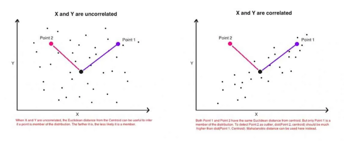

# Mahalanobis Distance

'Mahalanobis distance' 는 다변량 을 다루는 문제에서 점(또는 벡터) 과 분포 사이의 거리를 측정하는 효과적인 metric 이다.

거리를 측정하는 대표적인 measure로는 유클리디언 거리가 있다. 일반적으로 두 점사이의 거리를 측정하는데 사용하는 유클리디안 거리는 다변량의 문제에는 적합하지 않다. 'Mahalanobis distance'에 대해서 설명하기 이전에 유클리디언 거리가 가지는 한계점에 대해서 먼저 이야기해보자.

유클리디언 거리는 다음과 같은 식으로 정의된다.

$$
d(p,q) = \sqrt {(p_1-q_1)^2+(p_2-q_2)^2}
$$

두점사이의 거리를 측정할 때 위와 같은 방식으로 구할 수 있고 이를 n 차원으로 확장시키면 다음과 같다.

$$
d(p,q) = \sqrt {(p_1-q_1)^2+(p_2-q_2)^2 + ...+(p_n-q_n)^2}
$$

일반적으로 유클리디안 거리의 방법은 차원 간의 weight가 일정하거나, 또는 차원간 완전히 독립인 경우에 잘 작동한다. 하지만 실제 우리가 다루는 데이터에서는 쉽게 찾아보기 힘들다. 아래 예를 한번 보자.

| area(sq.ft) | price(1000's) | area(acre) | price(M) |
| ----------- | ------------- | ---------- | -------- |
| 2400        | 156000        | 0.50       | 156      |
| 1950        | 126750        | 0.46       | 126      |
| 2100        | 105000        | 0.48       | 105      |
| 1200        | 78000         | 0.44       | 78       |

위의 테이블은 같은 물품에 대해서 지역 간의 가격을 나타낸 것이다. 중앙을 기준으로 좌/우 테이블의 내용은 같지만 지역과 가격의 단위가 다르다. 문제는 실제로 내용/의미적으로 달리진 것이 없는데 단위의 변화로 유클리디안 거리의 값이 바뀌어 버린다. 물론 이런 문제는 '정규화'의 방법으로 해결이 가능하다. 예를들면 Z-transform 이나 Min-Max transform 처럼 말이다.

하지만 여기에는 또 다른 문제가 있다.

만약 한 차원이 다른 차원과 correlated 되어 있다면 유클리디안의 방식은 실제와 다른 잘못된 정보를 제공할 수 있다.

유클리디언 거리는 단순히 두점만 고려한다. 데이터 셋의 다른점들이 어떻게 분포 되어있는지는 고려대상이 아니다.위 그림에서  'point1'과 'point2'를 중심으로부터 유클리디언 거리를 측정한 것이다. 왼쪽 그림 처럼 두 변수의 상관관계가 없거나 높지 않은 경우 유클리디안 거리의 방식을 사용해도 문제가 되지 않는다.하지만 오른쪽 그림처럼 두 변수간의 상관관계가 높은 경우 유클리디안 방식으로 측정한다면 같은 거리를 가지겠지만, 실제로 '거리' 라는 개념에 부합할까? 가깝고 멀다는 맥락에서 'point2' 보다는 'point1'이 더 가까운 점이라고 생각하는것이 부합하지 않을까. 위의 예에서 우리는 단순히 점 들간의 비교가 아니라 해당 점이 데이터의 분포에서 얼마나 떨어져있는지도 고려해야함을 알 수 있다.

## Mahalanobis distance

**Mahalanobis distance**는 다음과 같이 정의된다.

$$
D^2 = (\mathbf x -\mu)^TC^{-1}(\mathbf x - \mu)
$$

구성 요소들에 대해서 한번 살펴보자.

$(\mathbf x -\mu)$ 는 평균으로 부터의 거리를 의미한다. Z-transform 을 아는 분들에게는 상당히 익숙한 표현일 수 있다. Z-transform은 $(x-\mu)/\sqrt\sigma$  으로 나타낼 수 있다.  'Mahalanobis distance'의 형태는 Z -scroe 을 제곱한 꼴이랑 같다. 

$$
D^2 = \frac {((\mathbf {x}\space vector)-(\mu \space vector))^2} {Cov} = (\mathbf x -\mu)^TCov^{-1}(\mathbf x -\mu)
$$

''두 벡터의 차'' 에 공분산을 나눠주는게 어떤 의미일까?  데이터 셋의 변수들이 강한 상관관계를 가지고 있다면 공분산은 증가하게 되고 자연스레 'Mahalanobis distance'가 줄어드는 효과를 가져다준다.상관관계가 높을 때 실제 물리적인 거리보다 더 가깝게 만들어주는 것이다. 반대로 변수들이 독립이거나 상관관계가 낮다면 공분산은 단위행렬과 가까워지게 되고 물리적인 거리와 거의 비슷한 거리값을 만들어주게 된다. 'Mahalanobis distance' 방법이 변수간의 상관관계에 효과적으로 대처할 수 있는 이유가 바로 이 떄문이다. 만약 모든 변수들이 독립이고 분산이 모두 1로 정규화되어 있다면, $Cov \space matrix = \sum = I$ 가 되고, 'Mahalanobis distance'는 유클리드 거리와 같아진다.

'Mahalanobis distance' 는 Z-score의 제곱의 형태를 가지는데 이는 'chi-square' 분포이다. 각 변수들이 정규분포인 상황이라면 각 샘플들이 평균으로부터 얼마나 멀리 떨어져 있는지 거리를 측정할 수 있다. 그리고 이 거리를 통해서 이 점이 이상치 인지 아닌지 역시 판단할 수 있다. 

## reference

https://www.machinelearningplus.com/statistics/mahalanobis-distance/

https://en.wikipedia.org/wiki/Mahalanobis_distance

[https://godongyoung.github.io/%EB%A8%B8%EC%8B%A0%EB%9F%AC%EB%8B%9D/2019/02/11/Mahalanobis-and-MCD.html](https://godongyoung.github.io/머신러닝/2019/02/11/Mahalanobis-and-MCD.html)