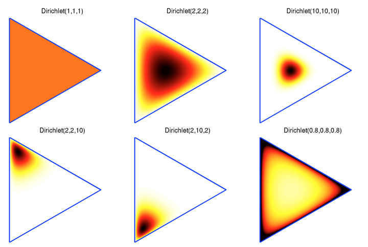

# PRML2-2_Multinomial

**"Multinomial ~ Dirichlet 의 관계는 Bernoulli ~ Beta 관계의 확장이다."**

pmf ~ pdf : pmf ~ pdf

## Bernoulli ~ Beta

binary 문제에서는 두가지의 가능성만 고려하면 된다.(**Bernoulli 시행**)
$$
x =0 \\
x= 1
$$

**<설문지 - 1000명>**

**Q)** 성별  - 남자/여자

**Q)** 결혼  - 기혼/미혼

**Q)** 병역  - 군필/미필

**<종합>**

**Q)** 450/550 : 0.45/0.55

**Q)** 200/800 : 0.2/0.8

**Q)** 400/600 : 0.4/0.6

두가지 선택지에 대해서 해당 선택지가 가지는 확률추정 ->  **Beta -distribution**

## Multinomial ~ Dirichlet

선택지가 여러개이다. 다양한 선택지중에서 하나를 고르는 시행(**Multinomial**)
$$
x=0 \\
x=1 \\
x=2 \\
...
$$

**<설문지 - 1000명>**

**Q)** 통신사 - LG/SKT/KT

**Q)** 강의평가 - 5/4/3/2/1

**Q)** 군대 - 해군/공군/육군/해병대

**<종합>**

**Q)** 300/350/350 : 0.3/0.35/0.35

**Q)** 200/200/400/100/100 : 0.2/0.2/0.4/0.1/0.1

**Q)** 100/200/700 : 0.1/0.2/0.7

다중선택지에서 해당 선택지가 가지는 확률 추정 -> **Dirichlet -distribution**

약 K개의 가능성이 있는 경우 확률변수 x는 어떻게 표현될 수 있을까. K=6 인 경우,  한가지 사건이 발생했고, 2 라는 사건이 발생했다면 ($x_2$) 우리는 x를 다음과같은 벡터로 표현할 수 있다.
$$
\mathbf x = (0,0,1,0,0,0)^T
$$
벡터의 합 $\sum x_k =1$ 이고, 이는 *어떤 사건이 실제 발생한 것을 표현한 것이다.*

이제는 각 사건이 일어날 가능성에 대해서 말해보자. 각사건이 일어날 확률이 모수 $\mu_k$ 에 의해 결정된다면
$$
p(\mathbf x|\mu) = \prod_k \mu_k^{x_k}
$$
$\mu = (\mu_1,..,\mu_K)^T$ 이다. 각 사건이 일어날 확률을 의미한다.

예를들면 $x_2$ 가 발생한 확률은
$$
u = (0.2, 0.3, 0.1, 0.3, 0.05,0.05)^T \\
p(x_2|\mu) = 0.2^0*0.3^0*0.1^1*0.3^0*0.05^0*0.05^0 = 0.1
$$
실제 일어난 사건 벡터 $\mathbf x$ 와 모수벡터 $\mu$ 의  곱으로 나타낼 수 있다.

정해진 확률공간에서 각 사건이 일어날 확률들의 합은 1이다. 
$$
\sum_x p(\mathbf x|\mu) = \sum^K_{k=1} \mu_k = 1 \\
0.2+0.3+0.1+0.3+0.05+0.05 = 1
$$

기대평균(기대값) 은 모수 $\mu$ 가 주어졌을 때 각 사건이 일어날 확률들과 각 사건의 곱의 합이다. 
$$
\begin{matrix}
E[x|\mu] &=& \sum_x p(x|\mu)x =  (\mu_1,..,\mu_M)^T = \mu \\
&=& 0.2*1 + 0.3*1 + 0.1*1+0.3*1+0.05*1+0.05*1=\mu
\end{matrix}
$$

이제는 관측치가 많아졌다. D = (x1 ,x2,...xN) 개
$$
D = \begin{pmatrix}
\mathbf x_1 \\
\mathbf x_2 \\
.. \\
\mathbf x_n  \end{pmatrix} = \begin{pmatrix} 0, 0, 0, 1, 0, 0\\ 1, 0, 0, 0, 0, 0 \\ ... \\ 0, 1, 0, 0, 0, 0\\ \end{pmatrix}^T
$$

likelihood는 다음과같다. 사건들이 일어날 확률들의 곱.(i.i.d 가정)
$$
\begin{matrix}
p(D|\mu) &=& \prod_n^N \prod_k^K\mu_k^{\mathbf x_{nk}} \\
&=& \prod_k^K\mu_k^{(\sum_nx_{nk})}  \\ 
&=& \prod_k^K\mu_k^{m_k}
\end{matrix}
$$

N개의 관측치들 중에서 해당 그룹의 총합.
$$
m_k = \sum_nx_{nk}
$$

likelihood 함수는 다음과 같다.
$$
Likelihood = p(D|\mu) = \prod_k^K\mu_k^{m_k}
$$

likelihood를 최대화 하는 모수가 실제 모수일 가능성이 높다(**MLE**). 찾는 방법은 log를 취해서 partial 미분하는것.
$$
\begin{matrix}
log(Likelihood) &=& log(\prod_k^K\mu_k^{m_k}) \\
&=& log(\mu_1^{m_1}\mu_2^{m_2}..\mu_K^{m_K}) \\
&=& log(\mu_1^{m_1}) +...+ log(\mu_K^{m_K})) \\
&=& \sum^{K}_{k} m_klog(\mu_k)
\end{matrix}
$$

하지만 제약조건이 존재한다.  *모든 발생가능한 선택지들의 확률합은  1*.

-> 라그랑주 승수법이 추가 된다.(Lagrange muliplier)
$$
\sum^{K}_{k} m_klog(\mu_k) + \lambda(\sum^K_k\mu_k-1)
$$

$$
\mu_k = -m_k/\lambda
$$

미분을 통해서 모수를 추정한 값은 따라서 다음과 같다.
$$
\mu^{ML}_k = m_k/N
$$

multinomial 분포의 likelihood 형태.
$$
Mult(m_1,...,m_k|\mu,N) = \begin{pmatrix}N\\m_1m_2m_3..m_k \end{pmatrix} \prod_k^K\mu_k^{m_K}
$$

$$
\sum^K_km_k = N
$$

## Dirichlet distribution

multinomial 분포의 family 이면서 다변량을 다룰수 있는 연속형 함수이다. 일반적인 형태는 다음과 같다.

$$
Dir(\mu|\alpha) = \frac {\Gamma(\alpha_0)} {(\Gamma(\alpha_1)..\Gamma(\alpha_K))}\prod_k^K\mu_k^{\alpha_k-1}
$$

* 모수는 $\alpha$에 의해서 결정되며 변량의 갯수만큼  모수를 가진다.

- k개의 random-variable을 샘플링 할 수 있다.(k차원)

- 따라서 이 k차원 vector는 `sum to 1`를 만족하기 때문에, multinomial 분포의 모수 $\mu$ 에 대한 prior 분포로 사용 될 수 있다.

- 모수인 $\alpha$ 가 모든 변량에 대해서 동일한 값을 가지면 symmetric한 중앙 집중적인 형태가 된다.

  

#### 모수 업데이트

$$
\begin{matrix}
p(\mu|D,\alpha) &=& Dir(\mu|\alpha+m) \\
&=& \frac {\Gamma(\alpha_0+N)} {(\Gamma(\alpha_1+m_1)..\Gamma(\alpha_K+m_K))} \prod_k^K\mu_k^{\alpha_k+m_k-1} 
\end{matrix}
$$
관측을 통해 데이터를 수집하면 데이터 벡터 $\mathbf x$ 가 모수 $\alpha$ 에 더해진다.

## reference

https://donghwa-kim.github.io/distributions.html

https://en.wikipedia.org/wiki/Dirichlet_distribution

