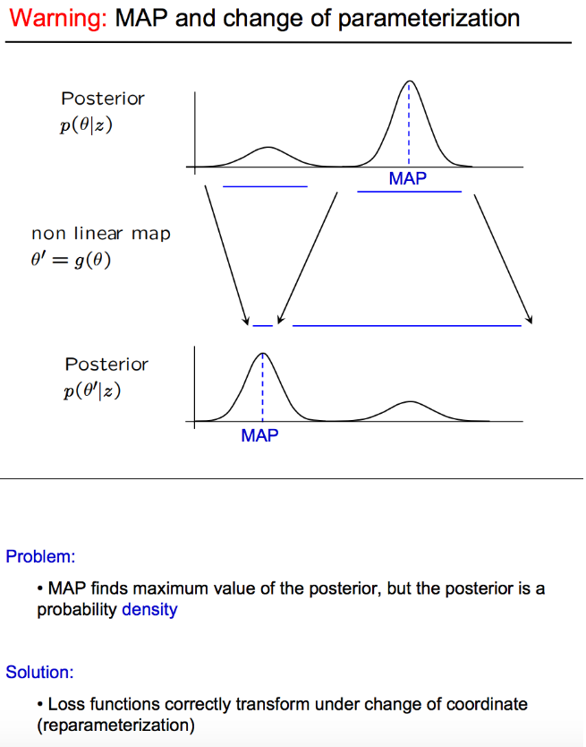
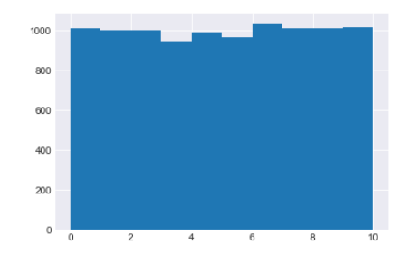
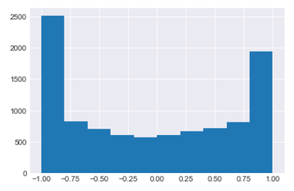

# reparameterization MAP vs MLE

**reparameterization** 은 베이지안 통계학을 공부하다 보면 자주 접할 수 있는 용어이다. 아마 접해본 사람들이 있다면 기존의 모수를 변환시켜서 다른 형태로 접근하려는 시도이거나 Variation AutoEncoder(VAE)에서 등장하는 'reparameterization trick' 또는 코딩을 하면서 샘플러가 쉽게 수렴하지 않을 때 'reparameterizaiton' 의 방법을 사용해 풀어본 경험에서 일 것이다.

오늘 포스팅은 MAP 추정은 reparametrization에 대해서 invariance 하지않는 반면에 MLE는 invariant한 성질에 대해서 이야기 해보려고한다.

사후분포는 probability **density** function(pdf) 이다. 확률밀도함수이기 때문에 integral은 항상 1인 상수이고, 이를 유지하기 위해서는 파라미터 공간의 변화에따라 확률도 변해야한다.

probability density는 제약을 받는다. 

$$
\int_A{p(y)dy} = \int_A {p(x)dx}
$$

이러한 제약이 reparametrization 시 probability densitiy를 변하게 만든다. 왜냐면 그냥 같은 함수값이 integral 했을때 같음을 보장하지 않기 때문이다.

반면 MLE는 확률밀도로 구하지 않는다. Likelihood 함수를 통해서 구하고 그렇기에 변화의 제한이 없다. 최댓값이 무엇이든 높이는 변하지 않는다. reparametrization 이후에도 최댓값은 변하지 않는다. 

likelihood는 data-space에서는 probability density 이다 p(x|&theta;) . 모수는 고정되어 있지만 데이터는 랜덤하다는 프리퀀티스트의 관점에 일치하는 내용이다. 하지만 function은 L(&theta;|X) ,parameter-space에서는 더이상 probability density가 아니다. 

Likelihood function은 모수에 대한 관측된 데이터들의 결합확률밀도로 구해진다. 보통 계산을 할때 (i.i.d) 가정을 이용해서 관측치들의 확률밀도의 곱으로 나타내는데, 이렇게 likelihood 함수가 구해지게 되면 데이터들은 더이상 랜덤하지 않다. 이미 실현화된 데이터들을 통해서 likelihood함수를 구했기 떄문이다. 이 상태에서 데이터는 고정되어 있다. 따라서  다음과 같은 L(&theta;|X) 모수에 대한 함수 형태로 수식을 설명한다. 모수 $\theta$ 와 L($\theta$|X) 의 관계에서 $\theta$ 가 어떤식으로 변하든 함수값 L($\theta$|X)의 크기는 변하지 않는다. 모수의 형태변화에 robust한것이다.

예를들어 보자 [0,10] uniform pdf 가 있다. 해당 공간에서 샘플링한 10000개의 데이터를 histogram으로 그리면 아래와 같다.

reparameterization을 다음과 같이 시행했다.
$$
x=[0,10] \rightarrow cos \space x
$$

바뀐 모수 공간에서 그려본 histogram은 아래와 같다

기존의 모든 공간에서 동일한 확률을 가지던것이 이제는 -1과 1 부근에서 더높은 확률을 가지게 되었다. 확률밀도함수 이기 때문에 제약을 유지하기 위해서 모수들의 공간도 변화한것이다.

## summary

reparameterization은 특히 베이지안 분석 시에는 주의해야 한다. 그 이유는 위에서 설명했듯이 모수들의 공간이 달라지기 때문이다. 반면 MLE를 통한 분석시에는 robust하다. Likelihood함수가 모수에 대한 밀도함수가 아니기 때문에 제약이 없기 떄문이다.

# reference

https://twiecki.io/blog/2017/02/08/bayesian-hierchical-non-centered/
